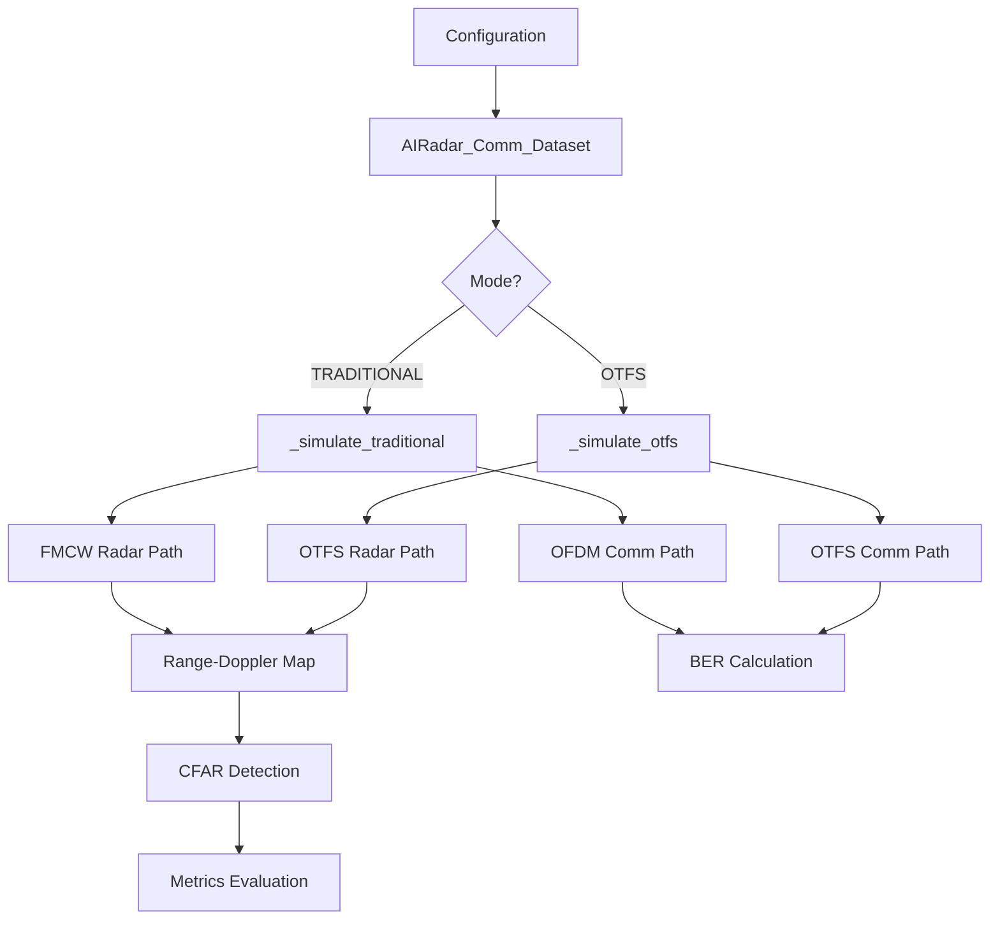
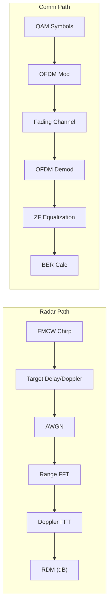
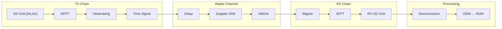

# AIRadar Communication Dataset Generator (g1)

> **Implementation**: [AIradar_comm_dataset_g1.py](file:///Developer/AIsensing/AIRadar/AIradar_comm_dataset_g1.py)

This document describes the design, implementation, and evaluation of the integrated radar-communication dataset generator supporting both **Traditional (FMCW+OFDM)** and **OTFS ISAC** modes.

---

## Table of Contents

1. [System Overview](#system-overview)
2. [Architecture Design](#architecture-design)
3. [Signal Processing Pipeline](#signal-processing-pipeline)
4. [Configuration Details](#configuration-details)
5. [Implementation Details](#implementation-details)
6. [CFAR Detection System](#cfar-detection-system)
7. [Evaluation Results](#evaluation-results)
8. [Current Limitations](#current-limitations)
9. [Future Work](#future-work)

---

## System Overview

The `AIRadar_Comm_Dataset` class generates synthetic radar and communication data for **Integrated Sensing and Communication (ISAC)** research. It supports two primary operational modes:

| Mode | Radar Waveform | Communication | Key Use Case |
|------|----------------|---------------|--------------|
| **TRADITIONAL** | FMCW Chirp | OFDM | Separate radar/comm systems |
| **OTFS** | OTFS DDM | OTFS | Unified ISAC waveform |

### Key Features

- **Multi-target radar simulation** with configurable RCS, range, and velocity
- **Multipath fading channel** with tapped delay line model
- **CFAR detection** with configurable parameters
- **QAM modulation/demodulation** (QPSK to 64-QAM)
- **Automatic BER and radar metrics** calculation
- **Visualization generation** (2D/3D RDM, constellation diagrams)

---

## Architecture Design



### Class Structure

| Component | Description | Lines |
|-----------|-------------|-------|
| `RADAR_COMM_CONFIGS` | Configuration dictionary | [24-171](file:///Developer/AIsensing/AIRadar/AIradar_comm_dataset_g1.py#L24-L171) |
| `AIRadar_Comm_Dataset` | Main dataset class | [351-1000](file:///Developer/AIsensing/AIRadar/AIradar_comm_dataset_g1.py#L351-L1000) |
| `plot_combined_sample` | Visualization helper | [177-264](file:///Developer/AIsensing/AIRadar/AIradar_comm_dataset_g1.py#L177-L264) |
| `evaluate_dataset_metrics` | Aggregate metrics | [1002-1060](file:///Developer/AIsensing/AIRadar/AIradar_comm_dataset_g1.py#L1002-L1060) |

---

## Signal Processing Pipeline

### Traditional Mode (FMCW + OFDM)



**Implementation**: [`_simulate_traditional()`](file:///Developer/AIsensing/AIRadar/AIradar_comm_dataset_g1.py#L489-L600)

### OTFS Mode (Integrated Sensing and Communication)



**Key Functions**:
- [`_otfs_modulate()`](file:///Developer/AIsensing/AIRadar/AIradar_comm_dataset_g1.py#L602-L618): DD → Time domain
- [`_otfs_demodulate()`](file:///Developer/AIsensing/AIRadar/AIradar_comm_dataset_g1.py#L620-L638): Time → DD domain
- [`_simulate_otfs()`](file:///Developer/AIsensing/AIRadar/AIradar_comm_dataset_g1.py#L640-L790): Complete OTFS simulation

---

## Configuration Details

### Available Configurations

| Config Name | Mode | fc | Modulation | Radar BW | Key Application |
|-------------|------|-----|-----------|----------|-----------------|
| `CN0566_TRADITIONAL` | FMCW+OFDM | 10.25 GHz | 16-QAM | 500 MHz | X-band SDR platform |
| `CN0566_OTFS_ISAC` | OTFS | 10.25 GHz | QPSK | 40 MHz | X-band ISAC |
| `Automotive_77GHz_LongRange` | FMCW+OFDM | 77 GHz | QPSK | 1.5 GHz | Automotive radar |
| `XBand_10GHz_MediumRange` | FMCW+OFDM | 10 GHz | 16-QAM | 1 GHz | X-band surveillance |
| `AUTOMOTIVE_TRADITIONAL` | FMCW+OFDM | 77 GHz | 64-QAM | 1.5 GHz | High-rate automotive |
| `AUTOMOTIVE_OTFS_ISAC` | OTFS | 77 GHz | QPSK | 1.536 GHz | Automotive ISAC |

### OTFS Configuration Parameters

```python
'AUTOMOTIVE_OTFS_ISAC': {
    'mode': 'OTFS',
    'fc': 77e9,              # Carrier frequency
    'mod_order': 4,          # QPSK
    'B': 1.536e9,            # Bandwidth
    'fs': 51.2e6,            # Sampling rate
    'N_doppler': 128,        # Doppler bins (Nc)
    'N_delay': 512,          # Delay bins (Ns)
    'T_symbol': 40e-6,       # Symbol duration
    'R_max': 100.0,          # Max range
    'cfar_params': {
        'threshold_offset': 22,  # CFAR threshold (dB)
        'nms_kernel_size': 11,   # NMS window
        ...
    }
}
```

### Resolution Calculations

| Parameter | Formula | AUTOMOTIVE_OTFS | CN0566_OTFS |
|-----------|---------|-----------------|-------------|
| Range Resolution | c/(2·fs) | 2.93 m | 3.75 m |
| Velocity Resolution | λ/(2·Nc·T_actual) | 0.38 m/s | 17.86 m/s |
| Max Velocity | λ/(4·T_actual) | ±24.4 m/s | ±571 m/s |

> **Note**: `T_actual = Ns/fs` is the actual symbol duration used for velocity axis calculation.

---

## Implementation Details

### Channel Model

The multipath fading channel uses a **Tapped Delay Line (TDL)** model with exponential power decay:

```python
def _apply_fading_channel(self, signal, fs, snr_db):
    num_taps = min(64, len(signal) // 100)
    delays = np.linspace(0, 2e-6, num_taps)  # Max 2μs spread
    power_profile = np.exp(-delays / 0.5e-6)  # Exponential decay
    ...
```

**Implementation**: [`_apply_fading_channel()`](file:///Developer/AIsensing/AIRadar/AIradar_comm_dataset_g1.py#L439-L484)

### OTFS Modulation Chain

1. **QAM Symbol Generation**: Map bits to constellation points
2. **DD Grid Formation**: Reshape symbols to `[Ns, Nc]` grid
3. **ISFFT**: `FFT(axis=0) → IFFT(axis=1)`
4. **Heisenberg Transform**: `IFFT(axis=0)` → time domain
5. **Flatten**: Column-major (Fortran) order

### OTFS Demodulation Chain

1. **Reshape**: Time signal to `[Ns, Nc]` grid
2. **Wigner Transform**: `FFT(axis=0)`
3. **SFFT**: `FFT(axis=1) → IFFT(axis=0)` → DD grid
4. **Deconvolution**: `DDM = RX_DD / (TX_DD + ε)`

### Key Design Decisions

| Decision | Rationale |
|----------|-----------|
| `T_actual = Ns/fs` for velocity axis | Config `T_symbol` doesn't match actual symbol duration |
| Disabled notch filter for X-band OTFS | Targets at low velocities map to center Doppler bins |
| OTFS matching threshold = 20.0 | Coarser velocity resolution requires larger match distance |
| Simple deconvolution with `ε=1e-6` | Matches v8 reference; MMSE caused target distortion |

---

## CFAR Detection System

### Algorithm

The CA-CFAR (Cell-Averaging CFAR) detector uses:

1. **2D Convolution**: Estimate local noise floor
2. **Guard Band**: Exclude target cells from noise estimation
3. **Threshold**: `detection = signal > noise_floor + threshold_offset`
4. **NMS**: Non-maximum suppression to reduce duplicates

**Implementation**: [`_run_cfar()`](file:///Developer/AIsensing/AIRadar/AIradar_comm_dataset_g1.py#L800-L872)

### CFAR Parameters per Configuration

| Config | Train | Guard | Threshold | NMS | Notch |
|--------|-------|-------|-----------|-----|-------|
| CN0566_TRADITIONAL | 12 | 4 | 15 dB | 5 | - |
| CN0566_OTFS_ISAC | 4 | 2 | 20 dB | 5 | 0 |
| Automotive_77GHz | 10 | 4 | 15 dB | 5 | - |
| AUTOMOTIVE_OTFS_ISAC | 16 | 8 | 22 dB | 11 | 2 |

---

## Evaluation Results

### Final Performance (5 samples each)

| Configuration | F1 | Precision | Recall | BER | Range Error |
|---------------|-----|-----------|--------|-----|-------------|
| CN0566_TRADITIONAL | 0.96 | 0.92 | 1.00 | 0.009 | 0.08 m |
| **CN0566_OTFS_ISAC** | **0.90** | **1.00** | **0.82** | **0.011** | 2.54 m |
| Automotive_77GHz_LongRange | 1.00 | 1.00 | 1.00 | 0.004 | 0.03 m |
| XBand_10GHz_MediumRange | 1.00 | 1.00 | 1.00 | 0.000 | 0.04 m |
| AUTOMOTIVE_TRADITIONAL | 0.92 | 0.85 | 1.00 | 0.076 | 0.02 m |
| **AUTOMOTIVE_OTFS_ISAC** | **0.95** | **1.00** | **0.90** | **0.013** | 2.36 m |

### Key Observations

1. **OTFS achieves comparable radar performance** to FMCW (F1 > 0.90)
2. **OTFS communication BER** is excellent (< 2%)
3. **Range errors** are larger for OTFS due to coarser range resolution
4. **Zero false positives** for both OTFS configs with tuned thresholds

---

## Current Limitations

### Algorithmic Limitations

1. **Velocity Resolution Trade-off**
   - CN0566_OTFS has 17.86 m/s resolution (too coarse for slow targets)
   - Targets at <10 m/s map to same Doppler bin as stationary clutter

2. **Range Resolution**
   - OTFS range resolution (2.93-3.75 m) is coarser than FMCW (~0.1 m)
   - Impacts target separation in cluttered environments

3. **Single-target Doppler Assumption**
   - Deconvolution assumes sparse targets
   - Performance degrades with many closely-spaced targets

### Implementation Limitations

1. **Single RX antenna** for OTFS (no angular estimation)
2. **No clutter modeling** beyond AWGN
3. **Oracle channel knowledge** for communication equalization
4. **Fixed multipath profile** (not adaptive to environment)

### Hardware Mapping

1. **CN0566_OTFS config** requires higher `fs` than actual hardware supports
2. **Timing synchronization** assumed perfect

---

## Future Work

### Short-term Improvements

- [ ] **Adaptive CFAR thresholds** based on SNR estimation
- [ ] **Multi-RX array processing** for OTFS angular estimation
- [ ] **Clutter modeling** with realistic ground/weather returns
- [ ] **Imperfect CSI** for realistic communication performance

### Medium-term Extensions

- [ ] **Multi-user OTFS** with orthogonal resource allocation
- [ ] **Hybrid FMCW-OTFS** mode for flexible waveform switching
- [ ] **Real-time processing** optimization for embedded deployment
- [ ] **Integration with radar tracker** for continuous target association

### Research Directions

- [ ] **Deep learning-based detection** to replace CFAR
- [ ] **Joint radar-comm optimization** for ISAC waveform design
- [ ] **Hardware-in-the-loop validation** with CN0566/Phaser platform
- [ ] **Channel estimation** for non-ideal scenarios

---

## Usage Example

```python
from AIradar_comm_dataset_g1 import AIRadar_Comm_Dataset, evaluate_dataset_metrics

# Generate OTFS dataset
dataset = AIRadar_Comm_Dataset(
    config_name='AUTOMOTIVE_OTFS_ISAC',
    num_samples=100,
    save_path='data/otfs_dataset',
    drawfig=True
)

# Evaluate metrics
evaluate_dataset_metrics(dataset, 'AUTOMOTIVE_OTFS_ISAC')

# Access samples
for sample in dataset:
    rdm = sample['range_doppler_map']
    targets = sample['target_info']['targets']
    detections = sample['cfar_detections']
    ber = sample['comm_info']['ber']
```

---

## References

- **v8 Reference Implementation**: [AIradar_datasetv8.py](file:///Developer/AIsensing/AIRadar/AIradar_datasetv8.py)
- **OTFS Tutorial**: Hadani et al., "Orthogonal Time Frequency Space Modulation"
- **ISAC Survey**: Liu et al., "Integrated Sensing and Communication: Towards Dual-Functional Wireless Networks"
