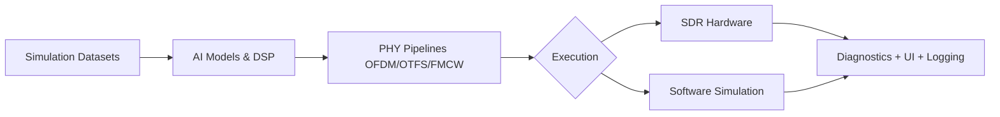

# AIsensing: AI + SDR for Wireless Communication and Radar

[](LICENSE)
[](#quick-start)
[](#quick-start)

AIsensing is an open-source research and engineering monorepo for wireless communication, radar sensing, and integrated sensing-and-communication (ISAC).  
It combines deep learning models, classical signal processing, and real SDR hardware workflows in one reproducible environment.

## Vision

The project is designed to close the gap between:

- simulation-first PHY research and deployable SDR pipelines,
- model-centric AI workflows and device-centric RF engineering,
- communication and radar stacks that are often developed separately.

In practice, this repo supports both rapid algorithm iteration and realistic end-to-end validation with ADI-based radios.

## What makes AIsensing different

- **Simulation + Hardware in one flow**: develop in Python simulation, then validate with Pluto/AD9361/ADRV9009/CN0566 paths.
- **Joint comm-radar focus**: includes OFDM/OTFS communication and FMCW/range-Doppler radar tooling under one roof.
- **AI-ready architecture**: dataset generation, model training, and inference pipelines are first-class citizens.
- **Lab-oriented tooling**: BER tests, sync diagnostics, loopback checks, device tuning scripts, and GUI apps.
- **Student-friendly codebase**: readable Python structure with many standalone scripts to learn from and modify.

## System Overview


```mermaid
flowchart LR
    A[Simulation Datasets] --> B[AI Models & DSP]
    B --> C[PHY Pipelines OFDM/OTFS/FMCW]
    C --> D{Execution}
    D --> E[Software Simulation]
    D --> F[SDR Hardware]
    F --> G[Diagnostics + UI + Logging]
    E --> G
```

## Repository Structure

### AIRadar — AI radar and ISAC research core

Path: [AIRadar/](AIRadar/)

AIRadar contains dataset engines, model training pipelines, and reusable library modules for radar/communication tasks.

#### Key capabilities

- **Dataset generation** for radar and communication variants, including ray-tracing flavored pipelines.
- **Training pipelines** across multiple model generations.
- **Joint communication-radar modeling** for multitask or shared-feature architectures.
- **Reusable processing library** for radar DSP, waveform helpers, and model blocks.
- **ISAC experiment framework** with method modules for OFDM, OTFS, and FMCW experimentation.

#### Major AIRadar code

| Area | Key Files | Description |
|---|---|---|
| Dataset generation | [AIradar_dataset.py](AIRadar/AIradar_dataset.py), [AIradar_datasetv8.py](AIRadar/AIradar_datasetv8.py), [AIradar_datasetraytracingv3.py](AIRadar/AIradar_datasetraytracingv3.py) | Synthetic and hybrid dataset construction for radar/comm tasks |
| Training pipelines | [AIradar_train.py](AIRadar/AIradar_train.py), [AIradar_trainv8.py](AIRadar/AIradar_trainv8.py), [AIradar_transformer_train.py](AIRadar/AIradar_transformer_train.py) | End-to-end training entry points for detector and transformer variants |
| Joint comm-radar | [AIradar_comm_models.py](AIRadar/AIradar_comm_models.py), [dl_joint_radar_comm.py](AIRadar/dl_joint_radar_comm.py), [Lidar2Radar_otfs_ofdm.py](AIRadar/Lidar2Radar_otfs_ofdm.py) | Shared architectures and multimodal comm-radar experimentation |
| AIRadarLib core | [signal_processing.py](AIRadar/AIRadarLib/signal_processing.py), [radar_det.py](AIRadar/AIRadarLib/radar_det.py), [modeling_transformer.py](AIRadar/AIRadarLib/modeling_transformer.py) | Core DSP blocks, radar detection logic, and transformer internals |
| ISAC experiments | [isac_experiment/main.py](AIRadar/isac_experiment/main.py), [isac_experiment/simulator.py](AIRadar/isac_experiment/simulator.py), [isac_experiment/methods/otfs.py](AIRadar/isac_experiment/methods/otfs.py) | Configurable ISAC research loops and simulation backends |

### sdradi — SDR integration, PHY runtime, and radar/video apps

Path: [sdradi/](sdradi/)

sdradi provides practical SDR scripts and reusable modules for communication/radar over real hardware.

#### Key capabilities

- **SDR abstraction and device setup** for ADI transceivers.
- **OFDM/OTFS PHY pipelines** with synchronization and equalization support.
- **FEC + MAC layers** for robust packetized transport.
- **Video-over-SDR implementations** including end-to-end lab scripts.
- **Radar runtime and visualization apps** for device-backed sensing.
- **Diagnostics and auto-tuning** utilities for faster bring-up.

#### Major sdradi code

| Area | Key Files | Description |
|---|---|---|
| SDR abstraction/config | [myad9361class.py](sdradi/myad9361class.py), [myadiclass.py](sdradi/myadiclass.py), [networkutils.py](sdradi/networkutils.py) | Device wrappers and connection helpers |
| OFDM/OTFS PHY | [myofdm.py](sdradi/myofdm.py), [sdr_video_commv2.py](sdradi/sdr_video_commv2.py), [sdr_video_commv2_lab.py](sdradi/sdr_video_commv2_lab.py), [otfs_radar_test.py](sdradi/otfs_radar_test.py) | Modulation, sync, demodulation, and link experiments |
| FEC/MAC | [sdr_ldpc.py](sdradi/sdr_ldpc.py), [sdr_mac.py](sdradi/sdr_mac.py), [benchmark_acc_fec.py](sdradi/benchmark_acc_fec.py) | Coding/recovery and performance benchmarking |
| Video-over-SDR | [sim_video_e2e_asyncv2_lab.py](sdradi/sim_video_e2e_asyncv2_lab.py), [run_video_txv2.py](sdradi/run_video_txv2.py), [run_video_rxv2.py](sdradi/run_video_rxv2.py) | End-to-end packetized media streaming pipelines |
| Radar hardware + UI | [myradar_all_in_one_v2.py](sdradi/myradar_all_in_one_v2.py), [radarappwdevice5.py](sdradi/radarappwdevice5.py), [test_cn0566_radarv2.py](sdradi/test_cn0566_radarv2.py) | Radar DSP + UI integrations for real device operation |
| Bring-up/diagnostics | [sdr_auto_tune.py](sdradi/sdr_auto_tune.py), [sdr_diagnostics_ui.py](sdradi/sdr_diagnostics_ui.py), [pluto_test/](sdradi/pluto_test/) | Cable checks, loopback tests, and health diagnostics |

### newsdr — latest lab branch and technical documents

Path: [newsdr/](newsdr/)

newsdr tracks the latest lab-focused evolutions of key SDR/radar modules plus companion technical documentation.

#### Current focus code

- [myradar_all_in_one_v2.py](newsdr/myradar_all_in_one_v2.py)
- [sdr_video_commv2_lab.py](newsdr/sdr_video_commv2_lab.py)
- [sim_video_e2e_asyncv2_lab.py](newsdr/sim_video_e2e_asyncv2_lab.py)
- [sdr_auto_tune.py](newsdr/sdr_auto_tune.py)
- [radarappwdevice5b.py](newsdr/radarappwdevice5b.py)

#### Technique docs added

- [myradar_all_in_one_v2_technique.md](newsdr/myradar_all_in_one_v2_technique.md)
- [sdr_video_commv2_lab_technique.md](newsdr/sdr_video_commv2_lab_technique.md)
- [sim_video_e2e_asyncv2_lab_technique.md](newsdr/sim_video_e2e_asyncv2_lab_technique.md)
- [sdr_auto_tune_technique.md](newsdr/sdr_auto_tune_technique.md)
- [radarappwdevice5b_technique.md](newsdr/radarappwdevice5b_technique.md)

## Quick Start

### 1) Clone repository

```bash
git clone https://github.com/lkk688/AIsensing.git
cd AIsensing
```

### 2) Create Python environment

```bash
python -m venv .venv
source .venv/bin/activate
pip install -U pip setuptools wheel
```

### 3) Install AIRadar package in editable mode

```bash
pip install flit
cd AIRadar
flit install --symlink
cd ..
```

### 4) Install workflow-specific dependencies

- For SDR Jetson-like workflow, start with [sdradi/requirements_jetson.txt](sdradi/requirements_jetson.txt).
- For notebook-driven research, install dependencies used in [deeplearning/](deeplearning/) notebooks/scripts.

### 5) Example commands

- Radar UI:

```bash
python sdradi/radarappwdevice5.py
```

- Video PHY loopback:

```bash
python sdradi/sdr_video_commv2_lab.py --mode loopback
```

- SDR auto tune/scanner:

```bash
python sdradi/sdr_auto_tune.py --mode rx
```

## PlutoSDR Setup and Recovery

This section mirrors key operational guidance from [docs/plutosdr_setup_guide.md](docs/plutosdr_setup_guide.md) for quick access.

### Quick recovery scripts

If you see errors such as device not found, driver symbol mismatch, or broken IIO contexts:

```bash
cd sdradi
./reset_drivers.sh
```

For dual-device setups, update the second Pluto as well:

```bash
cd sdradi
./update_second_pluto.sh
```

After firmware updates, unplug and replug all PlutoSDR devices.

### Hardware verification checklist

1. Verify USB detection:

```bash
lsusb
```

Look for `Analog Devices Inc. PlutoSDR`.

2. Verify IIO contexts:

```bash
iio_info -s
```

If this fails, run `./reset_drivers.sh`.

### Recommended connection mode

Use IP URIs for stability instead of changing USB URIs:

- TX/RX examples: `ip:192.168.2.2`, `ip:192.168.3.2`
- Keep SDR settings in [sdr_tuned_config.json](sdradi/sdr_tuned_config.json)

Example:

```json
{
  "sdr_ip": "ip:192.168.2.2",
  "rx_uri": "ip:192.168.3.2",
  "device": "pluto_dual"
}
```

### Known transport limitation on dual Pluto

On some high-performance hosts, dual Pluto TX/RX can show around 50% BER even when sync appears healthy.  
This has been observed over both USB and IP transports and is considered a host/driver transport limitation.

Recommended practical workflow:

1. Develop data-path and model logic in simulation (for example `AIradar_comm_dataset_g2.py`).
2. Use software loopback tests for PHY logic validation.
3. Use hardware mainly for synchronization/channel demonstrations when dual-device payload decoding is unstable on the host.

### Useful diagnostics commands

```bash
python sdradi/scan_devices.py
python sdradi/check_local_sdr.py
python sdradi/check_remote_sdr.py
```

## SDR Radios at a Glance

This project primarily targets ADI-compatible SDR workflows, with ADALM-PLUTO as a core development device.  
Reference details are in [docs/sdr_radios.md](docs/sdr_radios.md).

### ADALM-PLUTO quick profile

- RF coverage: 325 MHz to 3.8 GHz
- Instantaneous bandwidth: up to 20 MHz
- Sampling rate: up to 61.44 MSPS
- Default USB-network address: `192.168.2.1`
- Typical software stack: `libiio`, `pylibiio`, `pyadi-iio`

### Recommended SDR interface stack

- Low-level IIO transport and context handling via `libiio`/`pylibiio`
- High-level Python radio control via `pyadi-iio`
- Device visibility and attributes check with:

```bash
iio_info -s
iio_attr -a -C
```

### Common Pluto management notes

- Pluto firmware version can be checked with:

```bash
iio_attr -a -C fw_version
```

- Access over SSH:

```bash
ssh root@192.168.2.1
```

- Mass-storage config files (`config.txt`, `info.html`) can be used to inspect or adjust network setup.
- For dual-device workflows, static IP separation such as `192.168.2.2` and `192.168.3.2` keeps TX/RX roles stable.

### Python environment packages often used in SDR/radar UI workflows

```bash
pip install pyadi-iio pylibiio scipy matplotlib pyqtgraph pyqt6 opencv-python-headless pyopengl
```

## Typical Workflows

### Workflow A: AI model research

1. Generate/prepare dataset in `AIRadar`.
2. Train candidate models (`AIradar_train*`).
3. Evaluate model behavior on comm/radar metrics.
4. Export insights to SDR validation scripts in `sdradi`.

### Workflow B: SDR communication validation

1. Run device checks and loopback diagnostics.
2. Launch PHY tests (OFDM/OTFS paths).
3. Measure BER/SNR/throughput behavior.
4. Iterate FEC/MAC and synchronization parameters.

### Workflow C: Radar sensing experiments

1. Start radar engine and UI app.
2. Tune CFAR thresholds, minimum range, and compensation options.
3. Compare simulation mode vs hardware mode behavior.
4. Track detection quality and false-alarm characteristics.

## Major Recent Efforts

- Expanded lab-ready technical documentation in `newsdr/` for core radar/video/tuning scripts.
- Strengthened end-to-end SDR video lab pipelines (`sdr_video_commv2_lab.py`, async e2e variants).
- Added robust SDR bring-up and classification utilities (`sdr_auto_tune.py` and related tooling).
- Continued radar all-in-one evolution and GUI integration for hardware/simulation modes.
- Consolidated AIRadar and sdradi code paths to support both AI-centric and device-centric development.

## Additional Modules

- Deep learning baselines and communication experiments: [deeplearning/](deeplearning/)
- MATLAB simulation scripts: [matlab/](matlab/)
- Web visualization/API prototype: [WebApp/](WebApp/)
- GPU Holoscan area: [GPUHoloscan/](GPUHoloscan/)

## Documentation Index

- SDR architecture and workflows: [sdradi/sdr.md](sdradi/sdr.md)
- Waterfall visualization notes: [sdradi/otheradis/waterfall.md](sdradi/otheradis/waterfall.md)
- Latest lab technical docs: [newsdr/](newsdr/)

## Contribution Guide

Contributions are welcome for:

- OFDM/OTFS PHY enhancements
- radar DSP and target detection improvements
- SDR integration and diagnostics
- experiment reproducibility and benchmarking
- visualization/UI quality-of-life improvements

When opening a pull request, include:

- problem statement and scope,
- exact run commands,
- before/after metrics or screenshots where applicable,
- note on hardware/simulation environment used.

## License

This project is released under the [MIT License](LICENSE).
