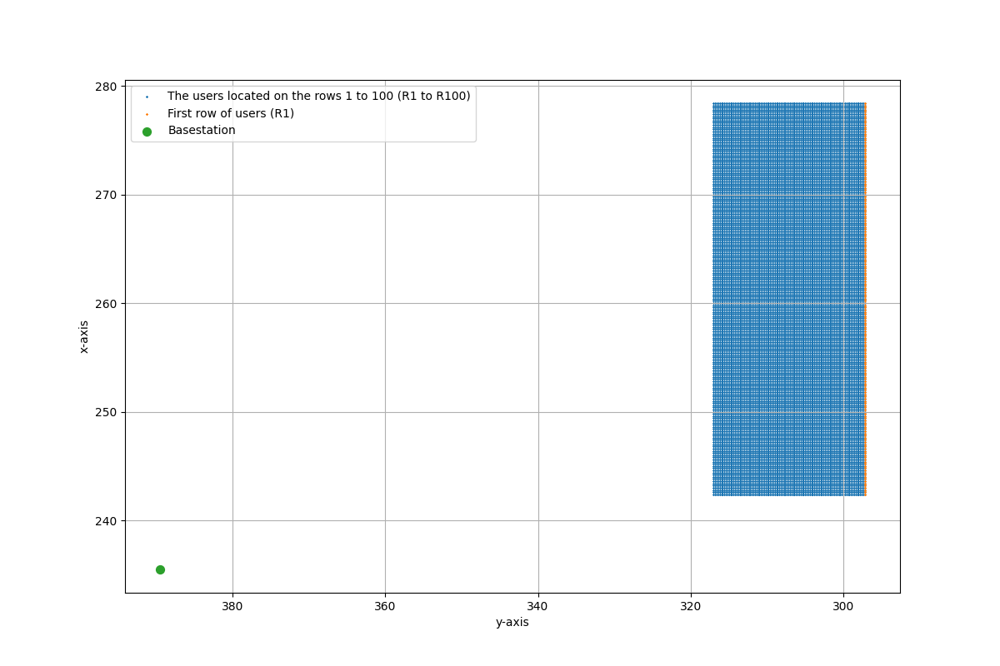
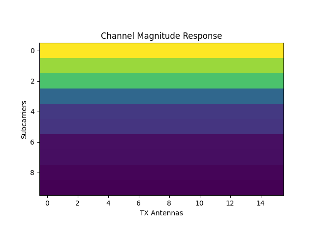
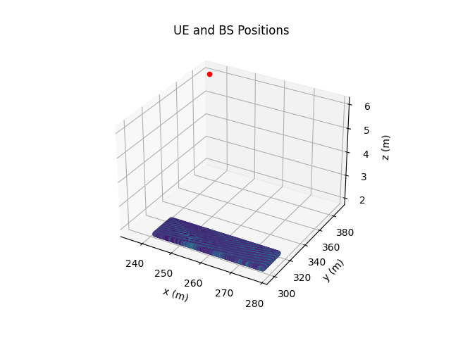
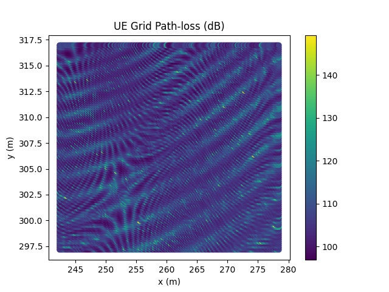
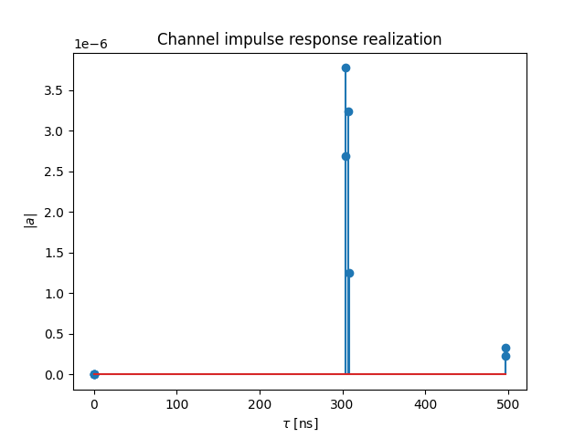
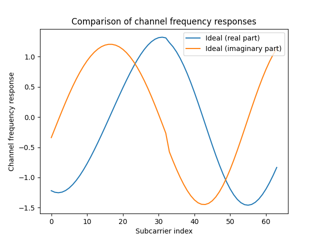
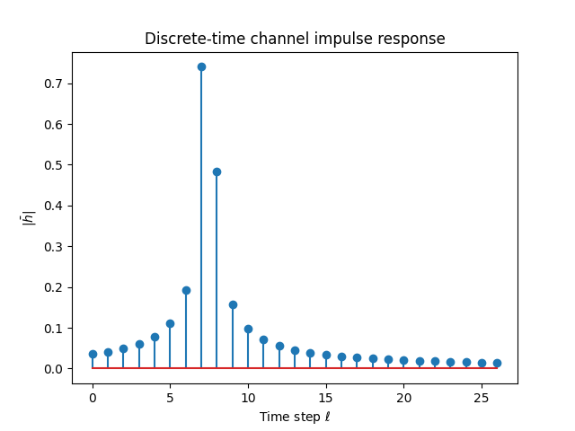
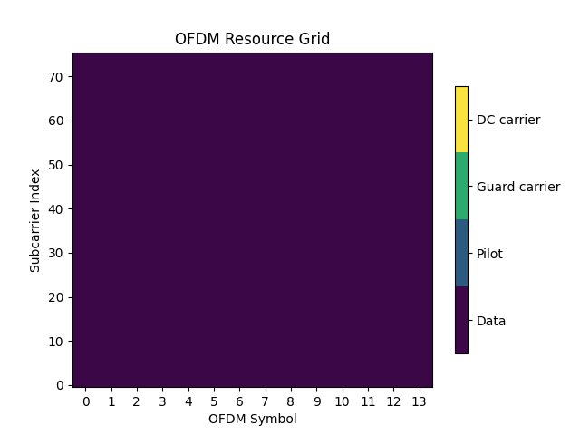
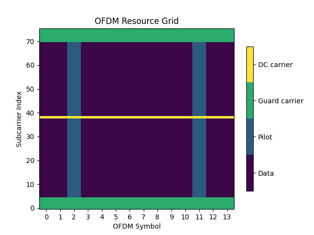
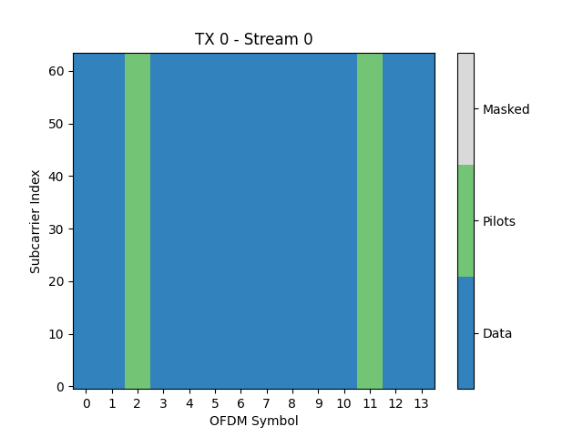

# Deep Learning-Based AI Processing Framework for Wireless Communication and Radar Sensing

## Introduction

Deep learning has revolutionized various application scenarios by significantly improving performance across domains. In the context of wireless communication, researchers have explored the potential of deep learning techniques to enhance system efficiency and reliability. In this work, we present our novel AI backend processing framework, designed to address critical challenges in wireless communication and radar sensing.

## Existing Solutions and Their Limitations

### NVIDIA SIONNA

One notable solution in this field is [NVIDIA SIONNA](https://developer.nvidia.com/sionna), which is open sourced at [sionna](https://github.com/NVlabs/sionna). SIONNA leverages the power of Tensorflow to accelerate AI physical-layer research. However, it has limitations:

1. **Simulation-Only Approach:** SIONNA operates solely on simulation data, lacking a real radio interface. This restricts its applicability to practical scenarios.

2. **Tensorflow Dependency:** SIONNA relies exclusively on the Tensorflow framework, limiting flexibility for researchers who prefer other deep learning libraries.

3. **Basic Neural Networks:** While effective, SIONNA's neural network architecture remains basic, missing out on advanced transformer models.

## Our Proposed AI Backend Processing Framework

### Key Features

Our new AI processing framework aims to overcome these limitations. It offers the following features:

1. **Hybrid Data Sources: Real Hardware Radio and Simulation Data**
   - Our framework interfaces seamlessly with both real hardware radio systems and simulation data. This dual approach ensures robustness and practical relevance.

2. **Flexible Libraries: Numpy, Pytorch, and Huggingface Transformers**
   - We leverage Numpy for efficient data preprocessing and simulation data preparation.
   - Pytorch serves as our primary deep learning framework, allowing researchers to build complex neural architectures.
   - Huggingface Transformers enhance our capabilities with advanced transformer models.

3. **Dual Capability: Communication and Radar Sensing**
   - Our framework provides AI processing capabilities for both communication tasks (e.g., OFDM symbol detection, demodulation, channel estimation) and radar sensing (target detection and tracking).
   - By combining these functionalities, we create a unified solution for diverse wireless applications.

### Implementation Details

1. **Pythonic Architecture**
   - Our backend processing framework is designed in Python, promoting readability, extensibility, and collaboration.
   - It offers a clear modular distinction between domain-specific components (e.g., OFDM communication, signal processing) and general-purpose deep learning models.

2. **Integration with Physical Hardware and DeepMIMO Dataset**
   - Researchers can seamlessly interface our framework with physical software-defined radio (SDR) hardware.
   - Additionally, we integrate with the DeepMIMO raytracing dataset, enabling comprehensive performance evaluation.

3. **Empowering Students**
   - Our open environment encourages Computer Science and Software Engineering students to innovate. Students can develop software and deep learning models using a specified general-purpose dataset format, without requiring deep domain-specific knowledge in wireless communication. 
   - Our AI processing framework bridges the gap between theory and practice, empowering researchers and students alike. As we refine our implementation, we anticipate further breakthroughs in wireless communication and radar sensing. By fostering collaboration and creativity, we build upon the solid foundation we've established.

## DeepMIMO
[DeepMIMO](https://deepmimo.net/) is a generic dataset that enables a wide range of machine/deep learning applications for MIMO systems. It takes as input a set of parameters (such as antenna array configurations and time-domain/OFDM parameters) and generates MIMO channel realizations, corresponding locations, angles of arrival/departure, etc., based on these parameters and on a ray-tracing scenario selected from those available in DeepMIMO.

DeepMIMO provides multiple scenarios that one can select from. We use the O1 scenario with the carrier frequency set to 60 GHz (O1_60). We need to download the "O1_60" data files from this [page](https://deepmimo.net/scenarios/o1-scenario/). The downloaded zip file should be extracted into a folder, and the parameter DeepMIMO_params['dataset_folder'] should be set to point to this folder. To use DeepMIMO with Sionna, the DeepMIMO dataset first needs to be generated. In our `deepMIMO5.py` file, we need to setup the `dataset_folder='data' #Windows part: r'D:\Dataset\CommunicationDataset\O1_60'` in the main file, and it will use the following function to get the DeepMIMO dataset:
```bash
DeepMIMO_dataset = get_deepMIMOdata(scenario=scenario, dataset_folder=dataset_folder, showfig=showfig)
```
The generated DeepMIMO dataset contains channels for different locations of the users and basestations. In our example, the users located on the rows `user_row_first` to `user_row_first`. Each of these rows consists of 181 user locations, resulting in `181*100=18100` basestation-user channels. The antenna arrays in the DeepMIMO dataset are defined through the x-y-z axes. In the following example, a single-user MISO downlink is considered. The basestation is equipped with a uniform linear array of 16 elements spread along the x-axis. The users are each equipped with a single antenna.
```bash
# Number of basestations
print(len(DeepMIMO_dataset)) #1
# Keys of a basestation dictionary
print(DeepMIMO_dataset[0].keys()) #['user', 'basestation', 'location']
# Keys of a channel
print(DeepMIMO_dataset[0]['user'].keys()) #['paths', 'LoS', 'location', 'distance', 'pathloss', 'channel']
# Shape of the channel matrix
print(DeepMIMO_dataset[active_bs_idx]['user']['channel'].shape) #(num_ue_locations=18100, 1, bs_antenna=16, strongest_path=10) 
# The channel matrix between basestation i=0 and user j=0, Shape of BS 0 - UE 0 channel
print(DeepMIMO_dataset[active_bs_idx]['user']['channel'][j].shape) #(1, 16, 10)
```

Ray-tracing Path Parameters are saved in dictionary, number of path is 9, and each key is a size of 9 array.
```bash
# Path properties of BS 0 - UE 0
print(DeepMIMO_dataset[active_bs_idx]['user']['paths'][j]) #Ray-tracing Path Parameters in dictionary
#'num_paths': 9, Azimuth and zenith angle-of-arrivals – degrees (DoA_phi, DoA_theta), size of 9 array
# Azimuth and zenith angle-of-departure – degrees (DoD_phi, DoD_theta)
# Time of arrival – seconds (ToA)
# Phase – degrees (phase)
# Power – watts (power)
# Number of paths (num_paths)
print(DeepMIMO_dataset[active_bs_idx]['user']['LoS'][j]) #Integer of values {-1, 0, 1} indicates the existence of the LOS path in the channel.
# (1): The LoS path exists.
# (0): Only NLoS paths exist. The LoS path is blocked (LoS blockage).
# (-1): No paths exist between the transmitter and the receiver (Full blockage).

print(DeepMIMO_dataset[active_bs_idx]['user']['distance'][j])
#The Euclidian distance between the RX and TX locations in meters.

print(DeepMIMO_dataset[active_bs_idx]['user']['pathloss'][j])
#The combined path-loss of the channel between the RX and TX in dB.
```
The BS location and UE locations are shown in this figure. The first row has 181 user locations, total user locations are 18100


The channel response is `(1, 16, 10)`, means 16 bs antenna, and 10 path components:


The following two figures show the UE and BS path loss and positions:




We use pytorch dataset class to wrap the deepmimo dataset, each iteration get `h` and `tau`. Define `batch_size`, and create a pytorch `DataLoader`
```bash
self.channeldataset = DeepMIMODataset(DeepMIMO_dataset=DeepMIMO_dataset, ue_idx=ue_idx)
h, tau = next(iter(self.channeldataset)) #h: (1, 1, 1, 16, 10, 1), tau:(1, 1, 10)
#complex gains `h` and delays `tau` for each path
#print(h.shape) #[num_rx, num_rx_ant, num_tx, num_tx_ant, num_paths, num_time_steps]
#print(tau.shape) #[num_rx, num_tx, num_paths]
self.data_loader = DataLoader(dataset=self.channeldataset, batch_size=batch_size, shuffle=True, pin_memory=True)
h_b, tau_b = next(iter(self.data_loader)) #h_b: [64, 1, 1, 1, 16, 10, 1], tau_b=[64, 1, 1, 10]
#print(h_b.shape) #[batch, num_rx, num_rx_ant, num_tx, num_tx_ant, num_paths, num_time_steps]
#print(tau_b.shape) #[batch, num_rx, num_tx, num_paths]
tau_b=tau_b.numpy()#torch tensor to numpy
h_b=h_b.numpy()
```
The plot of the channel impulse response is shown here (max 10 paths)


## Get CIR from Other Channels
The $h_b$, $tau_b$ generated is Channel Impulse Response (CIR), $h_b$'s shape meaning is `complex [batch, num_rx, num_rx_ant, num_tx, num_tx_ant, num_paths, num_time_steps]`, $tau_b$'s shape `float [batch, num_rx, num_tx, num_paths]`. We can also use simulation to generate CIR based on assumptions of Gaussian distributed i.i.d. path coefficients and uniformly distributed i.i.d. path delays:
```bash
# Random path coefficients
h_shape = [dataset_size, num_rx, num_rx_ant, num_tx, num_tx_ant, num_paths, num_time_steps]
h = (np.random.normal(size=h_shape) + 1j*np.random.normal(size=h_shape))/np.sqrt(2)
# Random path delays
tau = np.random.uniform(size=[dataset_size, num_rx, num_tx, num_paths])
```
If using CIR dataset, the `channel_model` will also generate $h$ and $tau$:
```bash
batch_size = 64 # The batch_size cannot be changed after the creation of the channel model
channel_model = channel.CIRDataset(generator,
                                      batch_size,
                                      num_rx,
                                      num_rx_ant,
                                      num_tx,
                                      num_tx_ant,
                                      num_paths,
                                      num_time_steps)
h, tau = channel_model()
```
It can also be generated by CDL channel model:
```bash
a, tau = cdl(batch_size=32, num_time_steps=rg.num_ofdm_symbols, sampling_frequency=1/rg.ofdm_symbol_duration)
```
The path gains a have shape `[batch size, num_rx, num_rx_ant, num_tx, num_tx_ant, num_paths, num_time_steps]` and the delays tau have shape `[batch_size, num_rx, num_tx, num_paths]`. The delays are assumed to be static within the time-window of interest. Only the complex path gains change over time. 

### channel frequency responses (frequency-domain)
If we want to use the continuous-time channel impulse response to simulate OFDM transmissions under ideal conditions, i.e., no inter-symbol interference, inter-carrier interference, etc., we need to convert it to the frequency domain. For the simulation of communication system based on OFDM, we can use the channel model to generate channel frequency responses $h_{freq}$. 
```bash
ofdm_channel = channel.GenerateOFDMChannel(channel_model, resource_grid)
# Generate a batch of frequency responses
# Shape: [batch size, num_rx, num_rx_ant, num_tx, num_tx_ant, num_ofdm_symbols, num_subcarriers]
h_freq = ofdm_channel()
```
This can also be done with the function `cir_to_ofdm_channel` that computes the Fourier transform of the continuous-time channel impulse response at a set of frequencies, corresponding to the different subcarriers. The frequencies can be obtained with the help of the convenience function subcarrier_frequencies.
```bash
frequencies = subcarrier_frequencies(rg.fft_size, rg.subcarrier_spacing)
h_freq = cir_to_ofdm_channel(frequencies, a, tau, normalize=True)
#We can apply the channel frequency response to a given input
# Function that will apply the channel frequency response to an input signal
channel_freq = ApplyOFDMChannel(add_awgn=True)
```

In the member function `def generateChannel(self, x_rg, no, channeltype='ofdm'):` of `class Transmitter` in `deepMIMO5.py`, it contains the `cir_to_ofdm_channel` function and generate the channel frequency responses
```bash
# Generate the OFDM channel response
#computes the Fourier transform of the continuous-time channel impulse response at a set of `frequencies`, corresponding to the different subcarriers.
#h: [64, 1, 1, 1, 16, 10, 1], tau: [64, 1, 1, 10] => (64, 1, 1, 1, 16, 1, 76) 
h_freq = mygenerate_OFDMchannel(h_b, tau_b, self.fft_size, subcarrier_spacing=60000.0, dtype=np.complex64, normalize_channel=True)
#h_freq : [batch size, num_rx, num_rx_ant, num_tx, num_tx_ant, num_time_steps, fft_size]
# Generate the OFDM channel
channel_freq = MyApplyOFDMChannel(add_awgn=True)
#h_freq : [batch size, num_rx, num_rx_ant, num_tx, num_tx_ant, num_time_steps, fft_size]
#(64, 1, 1, 1, 16, 1, 76)
y = channel_freq([x_rg, h_freq, no]) #h_freq is array
#Channel outputs y : [batch size, num_rx, num_rx_ant, num_ofdm_symbols, fft_size], complex    
#print(y.shape) #[64, 1, 1, 14, 76] dim (3,4 removed)
```

The figure of the channel frequency response is shown here:


### discrete-time impulse response (time-domain)
In the same way as we have created the frequency channel impulse response from the continuous-time response, we can use the latter to compute a discrete-time impulse response. This can then be used to model the channel in the time-domain through discrete convolution with an input signal. Time-domain channel modeling is necessary whenever we want to deviate from the perfect OFDM scenario, e.g., OFDM without cyclic prefix, inter-subcarrier interference due to carrier-frequency offsets, phase noise, or very high Doppler spread scenarios, as well as other single or multicarrier waveforms (OTFS, FBMC, UFMC, etc).

A discrete-time impulse response can be obtained with the help of the function cir_to_time_channel that requires a bandwidth parameter. This function first applies a perfect low-pass filter of the provided bandwith to the continuous-time channel impulse response and then samples the filtered response at the Nyquist rate. The resulting discrete-time impulse response is then truncated to finite length, depending on the delay spread. l_min and l_max denote truncation boundaries and the resulting channel has l_tot=l_max-l_min+1 filter taps. A detailed mathematical description of this process is provided in the API documentation of the channel models. You can freely chose both parameters if you do not want to rely on the default values.

In order to model the channel in the domain, the continuous-time channel impulse response must be sampled at the Nyquist rate. We also need now num_ofdm_symbols x (fft_size + cyclic_prefix_length) + l_tot-1 samples in contrast to num_ofdm_symbols samples for modeling in the frequency domain. This implies that the memory requirements of time-domain channel modeling is significantly higher. We therefore recommend to only use this feature if it is really necessary. Simulations with many transmitters, receivers, and/or large antenna arrays become otherwise quickly prohibitively complex.
```bash
l_min, l_max = time_lag_discrete_time_channel(rg.bandwidth)
l_tot = l_max-l_min+1

a, tau = cdl(batch_size=2, num_time_steps=rg.num_time_samples+l_tot-1, sampling_frequency=rg.bandwidth)
h_time = cir_to_time_channel(rg.bandwidth, a, tau, l_min=l_min, l_max=l_max, normalize=True)
# Function that will apply the discrete-time channel impulse response to an input signal
channel_time = ApplyTimeChannel(rg.num_time_samples, l_tot=l_tot, add_awgn=True)
```

In the member function `def generateChannel(self, x_rg, no, channeltype='ofdm'):` of `class Transmitter` in `deepMIMO5.py`, it contains the `cir_to_time_channel` function and generate the discrete-time channel impulse reponse
```bash
h_time = cir_to_time_channel(bandwidth, h_b, tau_b, l_min=l_min, l_max=l_max, normalize=True) 
#h_time: [batch size, num_rx, num_rx_ant, num_tx, num_tx_ant, num_time_steps, l_max - l_min + 1] complex[64, 1, 1, 1, 16, 1, 27]
channel_time = MyApplyTimeChannel(self.RESOURCE_GRID.num_time_samples, l_tot=l_tot, add_awgn=False)
y_time = channel_time([x_time, h_time]) #(64, 1, 1, 1090) complex
```
The plot of the discrete-time impulse reponse is shown:



## OFDM Processing:  `StreamManagement` and `ResourceGrid`

These DeepMIMO related code is in `class Transmitter():`, and the initialization is in `init` function side. In addition to these DeepMIMO related code, `init` function also contains the MIMO related code `StreamManagement` and `MyResourceGrid`
```bash
#NUM_STREAMS_PER_TX = NUM_UT_ANT
#NUM_UT_ANT = num_rx
num_streams_per_tx = num_rx ##1
RX_TX_ASSOCIATION = np.ones([num_rx, num_tx], int) #[[1]]
self.STREAM_MANAGEMENT = StreamManagement(RX_TX_ASSOCIATION, num_streams_per_tx) #RX_TX_ASSOCIATION, NUM_STREAMS_PER_TX
```
If no `Guard` is added, the resource grid is shown here with `RESOURCE_GRID.num_data_symbols=14(OFDM symbol)*76(subcarrier) array=1064` as the grid size and all 1064 grids are data.



Codeword length is `1064*(num_bits_per_symbol = 4)=4256`, Number of information bits per codeword is also `k=4256` if LDPC is not used.
```bash
b = binary_source([self.batch_size, 1, self.num_streams_per_tx, self.k]) #if empty [64,1,1,4256] [batch_size, num_tx, num_streams_per_tx, num_databits]
x = self.mapper(b=c) #if empty np.array[64,1,1,1064] 1064*4=4256 [batch_size, num_tx, num_streams_per_tx, num_data_symbols]
```
After `mapper`, the bits information (4256bits) has been converted to `[64,1,1,1064]` means 1064 symbols (`num_bits_per_symbol = 4`). `rg_mapper` will map the 1064 symbols into the resource grid `14*76=1064`
```bash
x_rg = self.rg_mapper(x) ##array[64,1,1,14,76] 14*76=1064
#output: [batch_size, num_tx, num_streams_per_tx, num_ofdm_symbols, fft_size][64,1,1,14,76]
```

If adding `Guard`, the resource grid shown here with `RESOURCE_GRID.num_data_symbols=14(OFDM symbol)*76(subcarrier) array=1064` as the grid size.


The pilot pattern is shown here and 1064 grids contains the data, DC and pilot. `RESOURCE_GRID.num_data_symbols=768` instead of 1064. 



If chose the time-domain channel, i.e., `channeltype=="time"`, ResourceGrid bandwidth is `bandwidth= self.fft_size(76)*self.subcarrier_spacing=4560000`. `l_min, l_max = time_lag_discrete_time_channel(bandwidth) #-6, 20` computes the smallest and largest time-lag for the descrete complex baseband channel. The smallest time-lag returned is always -6. This value was deemed small enough for all models. The largest time-lag is computed from the `bandwidth` and `maximum_delay_spread` as follows: $ L_{\text{max}} = \lceil W \tau_{\text{max}} \rceil + 6 $, where: $L_{\text{max}}$ represents the largest time-lag, $W$ corresponds to the bandwidth, $\tau_{\text{max}}$ is the maximum delay spread. The default value for `maximum_delay_spread` is 3 microseconds (3us). This value was found to be large enough to include most significant paths with all channel models, assuming a nominal delay spread of 100 nanoseconds.

`cir_to_time_channel`: Compute the channel taps forming the discrete complex-baseband representation of the channel from the Channel Impulse Response (CIR) (``a``, ``tau``). The channel impulse response represents how a channel responds to an impulse (delta function) transmitted through it.
It characterizes the channel’s behavior over time, including multipath effects, delays, and attenuation.

The function of `cir_to_time_channel` assumes that a sinc filter is used for pulse shaping and receive filtering. Therefore, given a channel impulse response $(a_{m}(t), \tau_{m}), 0 \leq m \leq M-1$, the channel taps are computed as follows:
```math
\bar{h}_{b, \ell}
= \sum_{m=0}^{M-1} a_{m}\left(\frac{b}{W}\right)
   \text{sinc}\left( \ell - W\tau_{m} \right)
```
for $`\ell`$ ranging from $l_{min}$ to $l_{max}$, and where $W$ is the $bandwidth$. Each tap ($\bar{h}_{b, \ell}$) represents the combined effect of all paths at a specific time lag ($\ell$). The sinc function accounts for the time delay and phase shift due to each path. Input $a$ is Path coefficients: `[batch size, num_rx, num_rx_ant, num_tx, num_tx_ant, num_paths, num_time_steps], complex`, e.g., `(64, 1, 1, 1, 16, 10, 1)`. $tau$ is Path delays [s]: `[batch size, num_rx, num_tx, num_paths], float`, e.g., `(64, 1, 1, 10)`. Output $hm$ is Channel taps coefficients: `[batch size, num_rx, num_rx_ant, num_tx, num_tx_ant, num_time_steps, l_max - l_min + 1], complex`, e.g., `[64, 1, 1, 1, 16, 1, 27]`.
The generated `h` is shown in this figure:

        