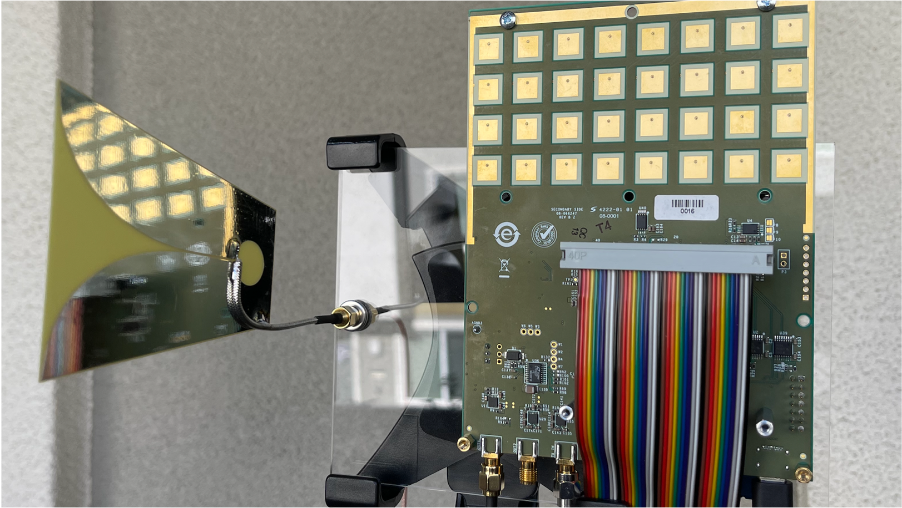
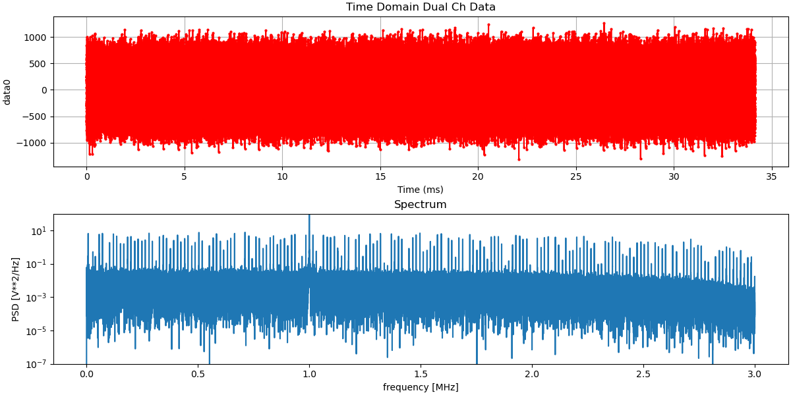
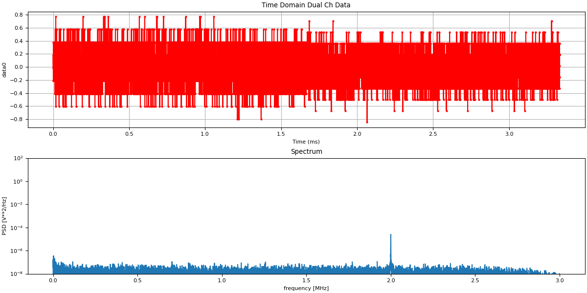
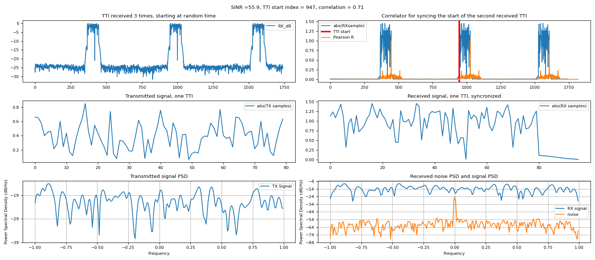
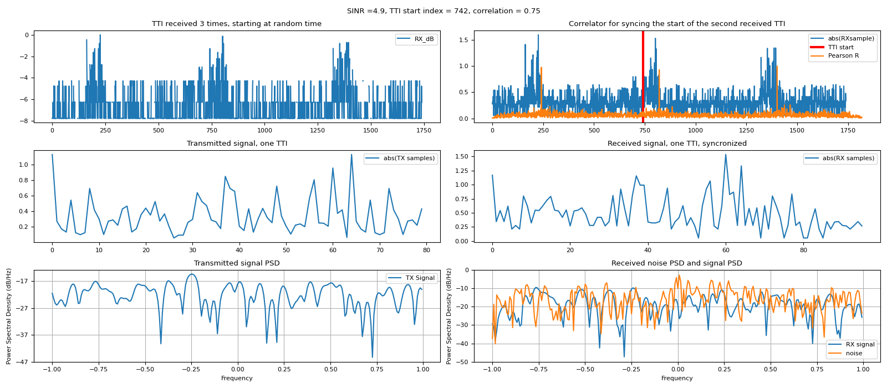
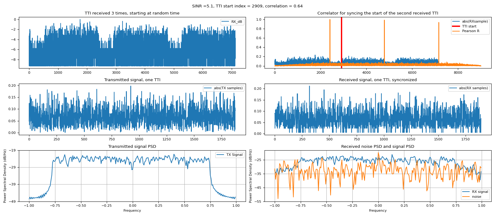
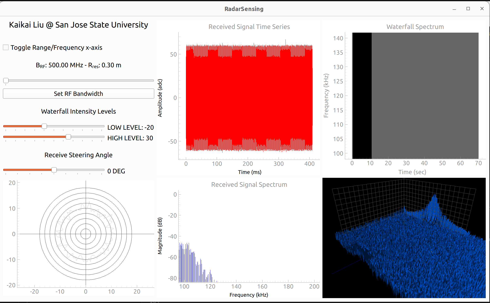
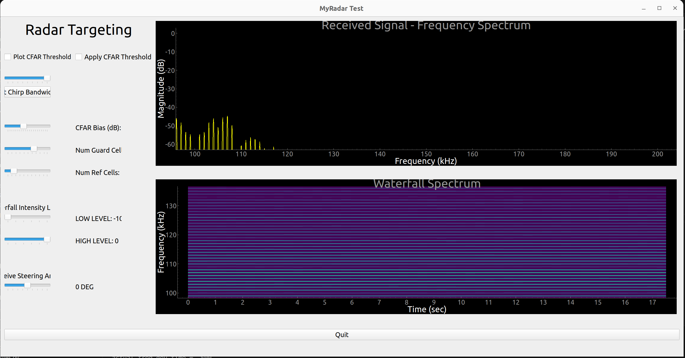

# Implementing Open Hardware Basestation Systems for future 5G/6G

## Introduction

Significant development efforts were dedicated to implementing an open hardware system designed to serve as the future software-defined 5G/6G base station prototype. This system is crucial for future 5G/6G wireless communication networks, enabling seamless connectivity, efficient data transfer, as well as advanced sensing and intelligent processing capabilities. It also allows for full software control and development of communication and sensing functionalities. Specifically, we developed two versions of the system in parallel, each targeting different deployment scenarios.

## Prototype Basestation Systems

### 1. Wideband Base Station Device

Our wideband base station device serves as the cornerstone of our base station system. It supports a wideband Orthogonal Frequency Division Multiplexing (OFDM) communication scheme with an impressive bandwidth of 200 MHz, adjustable via software from 75 MHz to 6 GHz. The software-defined radio transceiver features dual transmitters and dual receivers connected to MIMO antennas with integrated low-noise amplifiers (LNA). This configuration enables high-speed data transmission, making it suitable for research into next-generation networks like 5G and 6G. 

Beyond communication, the device incorporates radar sensing capabilities with a wide bandwidth of 400 MHz. This feature supports advanced applications such as target detection, environmental monitoring, and security surveillance. We utilize an additional observation receiver bandwidth of 450 MHz as the radar receiver, enabling a single device to support both communication and radar sensing. In addition to these fundamental radio features, our wideband base station device is equipped with an **Intel Arria10 FPGA** as the baseband processing unit and an on-board **NVIDIA Jetson Orin GPU** with 40 TOPS processing power as the main processor. 

Additional components in our Wideband Base Station Device include: onboard cameras, a Robosense 16-channel LiDAR, a solar panel and battery system, a PoE++ standard switch, and a power supply.

### 2. Cost-Effective Mobile Node

Complementing the wideband base station, our cost-effective mobile node offers an alternative solution for specific deployment scenarios. The mobile node provides a narrower software-defined communication bandwidth of 56 MHz. While not as extensive as the wideband base station, this bandwidth is sufficient for high-speed communication with a small number of nearby devices within smaller coverage areas. 

Due to the limited 56 MHz bandwidth, which is insufficient for radar sensing, we integrated an external frequency modulation chip outside the transceiver. This chip enables frequency sweeping of 500 MHz, granting the mobile node a frequency-modulated continuous wave (FMCW) radar sensing capability with a bandwidth of 500 MHz. This feature allows for precise distance measurements, making the mobile node suitable for applications such as target detection, positioning, and obstacle detection.


# SDR Devices

## Linux Kernel
The Linux kernel in this [repository](https://github.com/analogdevicesinc/linux) is the Linux kernel from Xilinx together with drivers & patches applied from Analog Devices. [Build the ADI Linux Kernel](https://wiki.analog.com/resources/tools-software/linux-drivers-all#building_the_adi_linux_kernel).

The Analog Devices kernel can be built to run on the Raspberry PI boards. Ref: [Linux Kernel for Raspberry Pi](https://wiki.analog.com/resources/tools-software/linux-build/generic/raspberrypi). For example, the kernel version of Raspberry Pi is 5.10 so that the correspondent latest rpi branch is rpi-5.10.y.

[Raspberry Pi Linux Kernel page](https://www.raspberrypi.com/documentation/computers/linux_kernel.html)

```bash
$ sudo apt install git
$ sudo apt install bc bison flex libssl-dev make
git clone https://github.com/analogdevicesinc/linux
cd linux
$ KERNEL=kernel7l
/linux $ ARCH=arm make adi_bcm2711_defconfig
#
# configuration written to .config
#
/linux $ ARCH=arm make #this takes a long time
```

## USB Access to ADI SDR devices

ADALM-PLUTO is based on Analog Devices AD9363--Highly Integrated RF Agile Transceiver and Xilinx® Zynq Z-7010 FPGA
  * ADALM-PLUTO Overview: https://wiki.analog.com/university/tools/pluto
  * Website: https://www.analog.com/en/design-center/evaluation-hardware-and-software/evaluation-boards-kits/adalm-pluto.html#eb-overview
  * RF coverage from 325 MHz to 3.8 GHz
  * Up to 20 MHz of instantaneous bandwidth
  * up to 61.44 Mega Samples per Second (MSPS)
  * ADI Book Software-Defined Radio for Engineers, 2018: https://www.analog.com/en/education/education-library/software-defined-radio-for-engineers.html
  * Analog Devices Board Support Packages Toolbox For MATLAB and Simulink: https://wiki.analog.com/resources/eval/user-guides/matlab_bsp

ADALM-PLUTO hardware: https://wiki.analog.com/university/tools/pluto/hacking/hardware
  * The PlutoSDR includes a button (S1 on the PCB), and two USB connectors. The first USB connector (the middle one) is the USB OTG connector (can be the USB HOST connector (cabled to a USB peripheral), or the USB peripheral connector (cabled to a USB Host)). The second USB connector (the one on the side) is for power only when running in Host mode.
  * New Rev D features: addition of internal U.FL connectors for: second receive channel, second transmit channel, Clock input, Clock output (only a copy of Clock input, not functional for the internal clock); USB UART; breakout pins for I2C and SPI; 3.3V GPO levels
  * Schematic: https://wiki.analog.com/_media/university/tools/pluto/hacking/plutosdr_schematic_revd_0.1.pdf
  * BOM: https://wiki.analog.com/_media/university/tools/pluto/hacking/plutosdr_bom_revd.xlsx
  * Allegro project: https://wiki.analog.com/_media/university/tools/pluto/hacking/plutosdr_brd_revd.zip
  * Cadence project: https://wiki.analog.com/_media/university/tools/pluto/hacking/plutosdr_cadence_revd.zip


ADALM-PLUTO for End Users: https://wiki.analog.com/university/tools/pluto/users
  * libiio USB device for communicating to the RF device
  * enumerate with the 192.168.2.1 IP address by default.
  * provides access to the Linux console on the Pluto device via USB Communication Device Class Abstract Control Model (USB CDC ACM) specification
  * Windows driver: https://wiki.analog.com/university/tools/pluto/drivers/windows
  * Linux driver: https://wiki.analog.com/university/tools/pluto/drivers/linux
  * MATLAB: https://www.mathworks.com/hardware-support/adalm-pluto-radio.html
    * Install Support Package for Analog Devices ADALM-PLUTO Radio: https://www.mathworks.com/help/supportpkg/plutoradio/ug/install-support-package-for-pluto-radio.html
    * Setup: https://www.mathworks.com/help/supportpkg/plutoradio/ug/guided-host-radio-hardware-setup.html
    * Manual Setup: https://www.mathworks.com/help/supportpkg/plutoradio/ug/manual-host-radio-hardware-setup.html
  * PlutoSDR (using python bindings to libiio): https://github.com/radiosd/PlutoSdr
  * pyadi-iio: https://wiki.analog.com/resources/tools-software/linux-software/pyadi-iio, https://analogdevicesinc.github.io/pyadi-iio/
  * GNU Radio and IIO Devices: gr-iio: https://wiki.analog.com/resources/tools-software/linux-software/gnuradio
  * Accessing Pluto's FPGA Over JTAG: https://wiki.analog.com/university/tools/pluto/devs/fpga
  * HDL code: https://github.com/analogdevicesinc/hdl/tree/master/projects/pluto

### Getting started for Windows
Plug the ADALM-PLUTO to the USB port of the HOST PC. Download and install the Windows driver from [link](https://wiki.analog.com/university/tools/pluto/drivers/windows), Once the drivers are installed, and the device (Pluto or M2k) is plugged in, the following subsystems should be ready to use:
  * USB Ethernet/RNDIS Gadget. It provides a virtual Ethernet link to most versions of the Windows, Linux and OS X operating systems. The IP address of the PLUTO device is 192.168.2.1.
  * To a host, the usb device acts as an external hard drive. There will be one drive for the pluto device. Open `info.html` inside the drive to see the device information. Under “Build Settings”. By default, it is username: root ; password is analog.
  * Serial Console (115200-8N1), in this case COM15, but it will be different on your PC. The terminal settings are 115200 baud, 8 bits, no parity, 1 stop bit. This is referred to as 115200-8N1. The default username is root, and the default root password is analog.
  * IIO USBD
  * Install [libiio](https://github.com/analogdevicesinc/libiio) under conda/python environment


```bash
(mycondapy310) PS D:\Developer\radarsensing> iio_info -s
Unable to create Local IIO context : Function not implemented (40)
Available contexts:
        0: 0456:b673 (Analog Devices Inc. PlutoSDR (ADALM-PLUTO)), serial=1044739a470b00060c00240091b07e0294 [usb:2.11.5]
(mycondapy310) PS D:\Developer\radarsensing> iio_attr -a -C fw_version
Using auto-detected IIO context at URI "usb:2.11.5"
fw_version: v0.37
```

Connect the device via ssh
```bash
ssh-keygen -R 192.168.2.16 #remove the entry from known_hosts
ssh root@192.168.2.16 #get the ip from the `info.html` page, password: analog
```

Pluto firmware update: https://wiki.analog.com/university/tools/pluto/users/firmware
  * Download the firmware (`plutosdr-fw-v0.38`), copy the entire unzipped firmware files to the Mass Storage device
  * Eject (don't unplug) the mass storage device, this will cause LED1 to blink rapidly. This means programming is taking place. Do not remove power (or USB) while the device is blinking rapidly. It does take approximately 4 minutes to properly program the device. Once the device is done programming, it will re-appear as a mass storage device. Now you can unplug it, and use it as normal.

```bash
(mycondapy310) PS D:\Developer\radarsensing> iio_attr -a -C fw_version 
Using auto-detected IIO context at URI "usb:2.12.5"
fw_version: v0.38
(mycondapy310) PS D:\Developer\radarsensing> iio_attr -a -C
Using auto-detected IIO context at URI "usb:2.12.5"
IIO context with 15 attributes:
hw_model: Analog Devices PlutoSDR Rev.C (Z7010-AD9363A)
hw_model_variant: 1
hw_serial: 1044739a470b00060c00240091b07e0294
fw_version: v0.38
ad9361-phy,xo_correction: 39999971
ad9361-phy,model: ad9363a
local,kernel: 5.15.0-175882-ge14e351533f9
uri: usb:2.12.5
usb,idVendor: 0456
usb,idProduct: b673
usb,release: 2.0
usb,vendor: Analog Devices Inc.
usb,product: PlutoSDR (ADALM-PLUTO)
usb,serial: 1044739a470b00060c00240091b07e0294
usb,libusb: 1.0.26.11724
(mycondapy310) PS D:\Developer\radarsensing> iio_info -n pluto.local
(mycondapy310) PS D:\Developer\radarsensing> iio_info -n pluto
(mycondapy310) PS D:\Developer\radarsensing> iio_info -u ip:192.168.2.1
```

[Customizing the Pluto configuration](https://wiki.analog.com/university/tools/pluto/users/customizing)
  * IETF reserve the IPv4 address range the 192.168.*.* (and others) for private networks. Analog Devices picked the 192.168.2.* subnet for it's private network for host to PlutoSDR devices
  * When using multiple PlutoSDR devices on the same host, there are a few options: usb mode via libiio, no changes are required, and things will work out of the box; network mode, where changes to the network settings are required. In order to use multiple devices, you must change their IP address. This is managed by updating the `config.txt` file on the PlutoSDR mass storage device

```
(mycondapy310) PS D:\Developer\radarsensing> ssh root@192.168.2.1 #password: analog
# fw_printenv attr_name
## Error: "attr_name" not defined
# fw_printenv attr_val
## Error: "attr_val" not defined
# fw_setenv attr_name compatible
# fw_setenv attr_val ad9364
# fw_setenv compatible ad9364
# reboot
```

Update the Pluto configuration to enable the AD9361's second channel, i.e., enable `2r2t`
```
(mycondapy310) PS D:\Developer\radarsensing> ssh-keygen -R 192.168.2.1
(mycondapy310) PS D:\Developer\radarsensing> ssh root@192.168.2.1
# fw_printenv attr_name
attr_name=compatible
# fw_printenv attr_val
attr_val=ad9364
# fw_printenv compatible
compatible=ad9364
# fw_printenv mode
mode=1r1t
# fw_setenv attr_name compatible
# fw_setenv attr_val ad9361
# fw_setenv compatible ad9361
# fw_setenv mode 2r2t
# reboot
```

Check the current mode:
```
(mycondapy310) PS D:\Developer\radarsensing> ssh-keygen -R 192.168.2.1
(mycondapy310) PS D:\Developer\radarsensing> ssh root@192.168.2.1
# fw_printenv attr_name
attr_name=compatible
# fw_printenv attr_val
attr_val=ad9361
# fw_printenv compatible
compatible=ad9361
# fw_printenv mode
mode=2r2t
$ exit
```

Run the test code for SDR:
```bash
(mycondapy310) PS D:\Developer\radarsensing> python .\sdradi\pysdr.py #transmitting a QPSK signal in the 915 MHz band, receiving it, and plotting the PSD
python sdradi/myad9361.py #perform transmit and plot the spectrum
```
### Getting started for Linux

Install the Linux driver from [link](https://wiki.analog.com/university/tools/pluto/drivers/linux)
  * In order to access some USB functions without root privileges, it's recommended to install the PlutoSDR or ADALM2000 udev rules. Download and install this [package](https://wiki.analog.com/_media/university/tools/pluto/drivers/plutosdr-m2k-udev_1.0_amd64.deb)

```bash
$ wget https://wiki.analog.com/_media/university/tools/pluto/drivers/plutosdr-m2k-udev_1.0_amd64.deb
$ sudo dpkg -i plutosdr-m2k-udev_1.0_amd64.deb
$ sudo service udev restart
#plug the device to the USB
$ sudo dmesg | less #Display All Messages from Kernel Ring Buffer, enter q to exit
    You can see usb 1-5: Product: PlutoSDR (ADALM-PLUTO)
$ sudo kermit -l /dev/ttyACM0 -b 115200
    Enter 'c', then type 'root' in pluto login, and 'analog' for password to enter into pluto
    $ uname -a
    Linux pluto 5.15.0-175882-ge14e351533f9 #1 SMP PREEMPT Fri Nov 17 10:23:58 CET 2023 armv7l GNU/Linux
    $ ifconfig
        usb0 inet addr:192.168.2.1
$ mount | grep -i pluto
$ ls -l /media/lkk/PlutoSDR/
$ firefox /media/lkk/PlutoSDR/info.html
$ /sbin/ifconfig
$ ip addr show
    enx00e022e5bbdd inet 192.168.2.10: is the emulated network device for USB
pluto login: root
Password: analog
```
The [dmesg](https://phoenixnap.com/kb/dmesg-linux) command is a Linux utility that displays kernel-related messages retrieved from the kernel ring buffer. The ring buffer stores information about hardware, device driver initialization, and messages from kernel modules that take place during system startup.. You can also monitor the kernel ring buffer in real-time using the --follow option `sudo dmesg --follow`. The option instructs the command to wait for new messages related to hardware or kernel modules after system startup. When searching for specific issues or hardware messages, pipe the dmesg output into grep to search for a particular string or pattern: `sudo dmesg | grep -i usb`.

Install IIO devices: [link](https://wiki.analog.com/university/tools/pluto/drivers/linux)

```bash
$ sudo apt-get install libiio-utils
$ iio_info -n 192.168.2.1 | grep device #find the IIO devices
IIO context has 6 devices:
	iio:device0: ad9361-phy
    iio:device1: xadc
    iio:device2: one-bit-adc-dac
    iio:device3: cf-ad9361-dds-core-lpc (buffer capable)
    iio:device4: cf-ad9361-lpc (buffer capable)
    iio:device5: adi-iio-fakedev
$ iio_readdev -n 192.168.2.1 -s 64 cf-ad9361-lpc | hexdump -x #Read from an IIO device buffer
```

Connect to the device and test the code:
```bash
$ iio_info -n pluto.local
$ iio_info -u ip:pluto.local
$ iio_info -u ip:192.168.2.1
$ ssh root@192.168.2.1
#password: analog
$ python sdradi/pysdr.py
```

### Mac OS Installation
It is recommended that Mac OS users build libiio from the [build instructions](https://github.com/analogdevicesinc/libiio/blob/master/README_BUILD.md)
```bash
(mypy310) (base) kaikailiu@Kaikais-MBP radarsensing % pip install pylibiio
(mypy310) (base) kaikailiu@Kaikais-MBP radarsensing % pip install pyadi-iio
(mypy310) (base) kaikailiu@Kaikais-MBP radarsensing % iio_info -s
Library version: 0.24 (git tag: v0.24)
Compiled with backends: xml ip usb
Unable to create Local IIO context : Function not implemented (78)
Available contexts:
        0: 0456:b673 (Analog Devices Inc. PlutoSDR (ADALM-PLUTO)), serial=10447376de0b000f00003000f0ba975eb8 [usb:1.7.5]
```


## SSH Access to **POE** Device with Phaser and SDR
The Radar is shown in this figure:


Using POE to power the Mobile Node, i.e., connect the POE cable to the Raspberry Pi Ethernet port with POE hat. The SDR radio is connected to the Raspberry Pi via USB; the Raspberry Pi itself will be served as the analog phaser. The POE will provide all the power to these devices. We can connect to the Mobile Node (i.e., Raspberry Pi) via host device (Mac, Linux or Windows) in the same network and you can ssh into the device via `ssh analog@phaser` (password: `analog`). You can also check the IP address of the device:

```bash 
sudo apt install nmap
ipconfig #check the current ip range
nmap -sn 192.168.1.0/24 #nmap -sn 192.168.86.0/24 #scan IP in the current network, nmap -sn 192.168.1.0/24 if the current network IP is 192.168.1.73
ssh analog@192.168.1.67 #analog@192.168.1.69 #password: analog
#second option
ssh analog@phaser
analog@phaser:~ $ ifconfig
    eth0: 192.168.1.67
    eth1: 192.168.2.10
    wlan0: 192.168.1.69
analog@phaser:~ $ ip addr show
sudo apt-get install usbip #To list all local USB-emulated network devices using usbip
analog@phaser:~ $ sudo usbip list -local
```

Upgrade:
```bash
ssh root@192.168.1.67 #analog@192.168.1.69 #password: analog
root@phaser:~# sudo apt update
root@phaser:~# sudo apt full-upgrade
```

To view all TCP or UDP ports that are being listened on, along with the associated services and socket status (you can see the port `50901` is for iiod): 
```bash
sudo netstat -tunlp
  tcp6       0      0 :::50901                :::*                    LISTEN      546/iiod
```

Check the analog devices inside the raspberry Pi:
```bash
analog@phaser:~ $ iio_attr -a -C fw_version #it will show multiple devices
analog@phaser:~ $ iio_info -u ip:phaser.local #show the Raspberry Pi phaser information
analog@phaser:~ $ iio_info -u ip:192.168.1.67 #use the IP to show the phaser information
analog@phaser:~ $ iio_info -u ip:192.168.2.10 #same information
analog@phaser:~ $ iio_info -u ip:192.168.1.69 #same information
analog@phaser:~ $ iio_info -u ip:phaser.local:50901 #show the SDR information (actual connection is USB)
    hw_model: Analog Devices PlutoSDR Rev.C (Z7010-AD9361)
    uri: ip:phaser.local
	ip,ip-addr: 192.168.2.10
    IIO context has 4 devices:
analog@phaser:~ $ iio_info -u ip:192.168.1.67:50901 #same to above
analog@phaser:~ $ iio_readdev -u ip:pluto.local -B -b 65768 cf-ad9361-lpc
    Throughput: 24 MiB/s
analog@phaser:~ $ iio_readdev -u ip:phaser.local:50901 -B -b 65768 cf-ad9361-lpc
    Throughput: 21 MiB/s
```

Check the analog devices from the host PC side:
```bash
lkk@lkk-intel12:~/Developer/AIsensing$ iio_info -u ip:192.168.1.69
  hw_carrier: Raspberry Pi 4 Model B Rev 1.5
iio_info -u ip:phaser.local #same result
iio_info -u ip:phaser #same result
lkk@lkk-intel12:~/Developer/AIsensing$ iio_info -u ip:phaser #same to above
lkk@lkk-intel12:~/Developer/AIsensing$ iio_info -u ip:phaser.local:50901 #show the sdr device
lkk@lkk-intel12:~/Developer/AIsensing$ iio_readdev -u ip:phaser.local:50901 -B -b 65768 cf-ad9361-lpc
Throughput: 16 MiB/s
lkk@lkk-intel12:~/Developer/AIsensing$ iio_readdev -u ip:192.168.1.67:50901 -B -b 65768 cf-ad9361-lpc
Throughput: 15 MiB/s
$ iio_attr -a -C fw_version 
Multiple contexts found. Please select one using --uri:
        0: 192.168.1.67 (cpu_thermal,rpi_volt,one-bit-adc-dac,adf4159,adar1000_1,adar1000_0,ad7291) [ip:phaser.local]
        1: 2600:1700:6470:1ac0::776 (cpu_thermal,rpi_volt,one-bit-adc-dac,adf4159,adar1000_1,adar1000_0,ad7291) [ip:phaser.local]
        2: 192.168.1.67 (Analog Devices PlutoSDR Rev.C (Z7010-AD9361)), serial=10447376de0b000f13002300f0ba97638d [ip:phaser.local:50901]
        3: 2600:1700:6470:1ac0::776 (Analog Devices PlutoSDR Rev.C (Z7010-AD9361)), serial=10447376de0b000f13002300f0ba97638d [ip:phaser.local:50901]
$ iio_attr -C --uri ip:phaser.local:50901 fw_version 
fw_version: v0.35
```

After upgrading the firmware, check the version again:
```bash
(base) lkk@lkk-intel12:~$ iio_attr -C --uri ip:phaser.local:50901 fw_version
fw_version: v0.38
(base) lkk@lkk-intel12:~$ iio_attr -C --uri ip:phaser:50901 fw_version
fw_version: v0.38
(base) lkk@lkk-intel12:~$ iio_attr -C --uri ip:192.168.1.69:50901 fw_version
fw_version: v0.38
```

Enable 2R2T model in SDR:
```bash
#ssh to PI:
(base) lkk@lkk-intel12:~$ ssh analog@phaser #password: analog
analog@phaser:~ $ ssh-keygen -R 192.168.2.1
analog@phaser:~ $ ssh root@192.168.2.1 #password: analog
$ fw_printenv mode
mode=1r1t
$ fw_setenv attr_name compatible
$ fw_setenv attr_val ad9361
$ fw_setenv compatible ad9361
$ fw_setenv mode 2r2t
$ reboot
```

Re-enter into the SDR device and check the current device status:
```bash
analog@phaser:~ $ ssh-keygen -R 192.168.2.1
analog@phaser:~ $ ssh root@192.168.2.1 #password: analog
$ fw_printenv attr_name
attr_name=compatible
$ fw_printenv attr_val
attr_val=ad9361
$ fw_printenv compatible
compatible=ad9361
$ fw_printenv mode
mode=2r2t
$ exit
```
There is another `device_reboot` option in [link](https://wiki.analog.com/university/tools/pluto/devs/reboot)

When multiple SDR devices available
```bash
lkk@lkk-intel12:~$ iio_attr -a -C fw_version 
Multiple contexts found. Please select one using --uri:
	0: 192.168.2.1 (Analog Devices PlutoSDR Rev.C (Z7010-AD9361)), serial=10447376de0b000f00003000f0ba975eb8 [ip:pluto.local]
	1: 0456:b673 (Analog Devices Inc. PlutoSDR (ADALM-PLUTO)), serial=10447376de0b000f00003000f0ba975eb8 [usb:1.10.5]
$ iio_attr -C fw_version  --uri usb:1.10.5
fw_version: v0.38
$ iio_attr -C fw_version --uri ip:pluto.local
fw_version: v0.38
$ iio_info -u ip:pluto.local
$ iio_info -u usb:1.10.5
$ iio_info -u ip:192.168.2.1
```
## SSH to ADRV9009 with Xilinx FPGA
```bash
% ssh root@192.168.86.29 #analog
root@analog:~# iio_attr -a -C fw_version
root@analog:~# iio_info -u ip:192.168.86.29
```

## TDD Engine
The latest version of `pyadi-iio' from pip is `0.016` and does not contain the tddn. Need to install the pyadi-iio from source.
```bash
python
  import adi
  print(adi.__version__)
  #0.0.16 tddn not available there
git clone https://github.com/analogdevicesinc/pyadi-iio.git
(mycondapy310) PS D:\Developer\pyadi-iio> pip install .
  Successfully installed pyadi-iio-0.0.17
python
>>> import adi
>>> print(adi.__version__)
0.0.17
```

## Processing Code
Install Pytorch and Tensorflow
```bash
nvcc -V #11.8
pip install --upgrade pip
pip install torch torchvision torchaudio --index-url https://download.pytorch.org/whl/cu118
#test torch in Python
  import torch
  torch.cuda.is_available()
pip install tensorflow[and-cuda] #it will install nvidia_cuda_nvcc_cu12, nvidia_cudnn_cu12, nvidia_cublas_cu12
python3 -c "import tensorflow as tf; print(tf.config.list_physical_devices('GPU'))" #GPU cannot be detected
pip install tensorflow[and-cuda]==2.14.0 #https://www.tensorflow.org/install/source#tested_build_configurations latest 16.1 only support cuda12
#install nvidia_cudnn_cu11-8.7.0.84, nvidia_cuda_nvcc_cu11-11.8.89, tensorrt-8.5.3.1-cp310
```

## Communication Test code
Run the test code `.\sdradi\pysdr.py` for SDR (revise the IP for the device):
```bash
python sdradi/pysdr.py #transmitting a QPSK signal in the 915 MHz band, receiving it, and plotting the PSD

```

Perform transmit test, detect peak frequency, and plot the spectrum:
```bash
python sdradi/myad9361.py
```
The result figure is 


## Communication class
Newly added `myad9361class.py` that put all sdr related code into one class. Run the following code to test the SDR class and perform signal detection
```bash
python sdradi/myad9361class.py
```
This code contains several test cases: 

1) `test_SDRclass`, which performs continuous data transmission and receive. The result figure is


2) `test_SDRTDD`, which performs TDD test for communication.

3) `test_ofdm_SDR`, which performs correction for the received sample and detect the starting point. 

### OFDM with SDR
`sdradi/myofdm.py` contains OFDM related code. `myad9361class.py` integrates the `myofdm.py` to transmit the OFDM signals. 
  * The `test_ofdm_SDR` function mainly tests the `SDR_RXTX_offset` function with basic OFDM signal. 
  * The `test_ofdmmimo_SDR` function integrates the OFDM MIMO signal.

The output format is `[IQ, SINR, SDR_TX_GAIN, SDR_RX_GAIN, fails + 1, corr, sdr_time]` where
  * IQ is the IQ data in format expected by demodulator
  * SINR is the measured SINR based on noise power measurement during the unmodulated symbols, and the mean power of the received and synchronised signal.
  * SDR_RX_GAIN similar to above, the actual RX setting
  * fails+1 is the number of repeated processes if correlation check fails. If this happens, TX power is increased each time.
  * corr os the Pearson correlation of the tx and rx signals
  * sdr_time is the measured time from start of the SDR process to finishing it. When debug is enabled, it takes about 1.4sec and without it takes 25ms in authors computer.

The result figure of `test_ofdm_SDR` (plotted by `plot_noisesignalPSD` in `processing.py`) for Pulto SDR is shown as:



The result figure for the POE Radar is (less coupling between the transmitter and receiver, i.e., lower SINR):



Using **OFDM MIMO** (`class OFDMAMIMO`) and run `test_ofdmmimo_SDR`, the result is


## Radar Class
Check the Section `Radar UI` to install the required packages.

`sdradi/myradar2.py` contains `class RadarDevice`, `class RadarData`, and all the hardware setup code for Radar device. Run `myradar2.py` to collect radar data and save to numpy.


`sdradi/pyqt6appwdevice.py` contains the UI for Radar (shown in the following figure) and access the `class RadarDevice` and `class RadarData` from `sdradi/myradar2.py`. Use the flag `UseRadarDevice` to choose Radar SDR device or collected data from `myradar2.py`. 




# Radar UI 


## Windows part
Test mayavi:
```bash
pip install PySide6
pip install pyqtgraph
python sdrpysim/testmayavi.py
```

Test pyqt:
```bash
python sdrpysim/testpyqt56side6.py #Runtime="QT6"#"QT6" works in windows
```

Run Radar App based on local dataset:
```bash
python .\sdrpysim\pyqt6app.py
```

Newly created radar UI: `sdradi/radar_ui.py`

## Linux part
Setup Python environment for Radar UI:
```bash
pip install pyqt6
#test pyqt6: sdrpysim/testpyqt6.py
pip install pyqtgraph
pip install pyopengl
$ sudo apt install libxcb-cursor0 #solve the problem: "qt.qpa.plugin: Could not load the Qt platform plugin "xcb"
$ conda install -c conda-forge libstdcxx-ng #solve the problem of libGL error: MESA-LOADER: failed to open iris
```


          
# Software-Defined Radio (SDR) System

This document provides a comprehensive overview of the Software-Defined Radar (SDR) system implemented in the `SDR` class (myadiclass.py). The system leverages software-defined radio technology to create a flexible and programmable radar platform for research, development, and practical applications. 

The SDR class provides a comprehensive framework for software-defined radar applications. Its flexible architecture, extensive feature set, and innovative capabilities make it suitable for a wide range of applications from research to practical deployment. The system's modular design allows for easy extension and customization, making it an ideal platform for radar system development.

## System Architecture

The SDR class serves as a high-level abstraction for controlling software-defined radio hardware, specifically designed to work with Analog Devices' radio platforms including:

- AD9361
- AD9364
- ADRV9009

The architecture follows a modular design pattern that separates:

1. **Hardware Configuration** - Setup and management of SDR parameters
2. **Signal Generation** - Creation of various waveforms for transmission
3. **Signal Reception** - Capture and processing of received signals
4. **Signal Processing** - Analysis and manipulation of radar data

## Key Features

### Hardware Configuration

- **Multi-device Support**: Compatible with multiple Analog Devices SDR platforms
- **Flexible Channel Configuration**: Support for single or dual channel operation
- **Dynamic Parameter Adjustment**: Runtime configuration of frequency, bandwidth, sample rate, and gain

### Signal Transmission

- **Waveform Generation**: Built-in support for sinusoidal and DDS (Direct Digital Synthesis) waveforms
- **Cyclic Transmission**: Option for continuous signal transmission
- **Signal Conditioning**: Automatic normalization and scaling of transmitted signals
- **Multi-channel Transmission**: Support for dual-channel transmission with independent signals

### Signal Reception

- **Configurable Reception**: Adjustable buffer size and gain control modes
- **Continuous Reception**: Support for extended data collection periods
- **Multi-channel Reception**: Ability to receive from multiple antennas with combining options
- **Signal Normalization**: Automatic scaling of received signals

### Signal Processing

- **Spectrum Analysis**: Built-in spectral analysis capabilities
- **Signal Correlation**: Detection of signal offset and correlation between transmitted and received signals
- **SINR Measurement**: Signal-to-Interference-plus-Noise Ratio calculation
- **Visualization**: Support for real-time plotting of signals and spectra

## Technical Specifications

| Parameter | Range | Description |
|-----------|-------|-------------|
| Center Frequency | Up to 6 GHz | Configurable transmit and receive frequency |
| Sample Rate | Up to 61.44 MSPS | Adjustable sampling rate |
| Bandwidth | Up to 56 MHz | Configurable RF bandwidth |
| Gain Control | Manual or Automatic | Configurable gain control modes |
| Buffer Size | Configurable | Adjustable receive buffer size |
| Channels | 1-2 | Support for single or dual channel operation |

## System Setup

### Hardware Requirements

- Analog Devices SDR platform (AD9361, AD9364, or ADRV9009)
- Host computer with network connectivity
- Appropriate antennas and RF connections

### Software Dependencies

```python
import adi
import numpy as np
from scipy import signal
import matplotlib.pyplot as plt
from timeit import default_timer as timer
import time
import sys
```

### Initialization

The system is initialized with the following parameters:

```python
sdr = SDR(
    SDR_IP="ip:192.168.2.1",        # IP address of SDR device
    SDR_FC=2000000000,              # 2 GHz center frequency
    SDR_SAMPLERATE=1e6,             # 1 MHz sample rate
    SDR_BANDWIDTH=1e6,              # 1 MHz bandwidth
    Rx_CHANNEL=2,                   # Dual-channel reception
    Tx_CHANNEL=1,                   # Single-channel transmission
    device_name='ad9361'            # Device type
)
```

## Usage Examples

### Basic Transmission and Reception

```python
# Configure transmitter
sdr.SDR_TX_setup(tx1_gain=-10)

# Generate and transmit a sinusoidal signal
sdr.SDR_TX_signalgen(signal_type='sinusoid', f_signal=100000, N=1024)

# Configure receiver
sdr.SDR_RX_setup(n_SAMPLES=8192, rx1_gain=30)

# Receive signal
rx_data = sdr.SDR_RX_receive()

# Stop transmission
sdr.SDR_TX_stop()
```

### Continuous Reception with Spectrum Analysis

```python
# Configure receiver
sdr.SDR_RX_setup(n_SAMPLES=8192, rx1_gain=30)

# Receive data continuously for 5 seconds with spectrum analysis
rx_data, process_times = sdr.SDR_RX_receive_continuous(
    T_len=5,
    spectrum=True,
    plot_flag=True
)
```

### Signal Offset Detection

```python
# Create test signal
test_signal = np.exp(1j * 2 * np.pi * 0.1 * np.arange(1024))

# Transmit and receive with offset detection
rx_signal, sinr, tx_gain, rx_gain, attempts, correlation, process_time = sdr.SDR_RXTX_offset(
    SAMPLES=test_signal,
    leadingzeros=500,
    add_td_samples=16
)
```

## Features

### 1. Dynamic Hardware Abstraction

The system implements a flexible hardware abstraction layer that automatically adapts to different SDR platforms. The `setupSDR` method dynamically configures the appropriate driver based on the specified device type:

```python
def setupSDR(self, fs=6000000, device_name='ad9361', Rx_CHANNEL=2, Tx_CHANNEL=1):
    if device_name.lower()=='ad9361':
        sdr = ad9361(uri=self.SDR_IP)
    elif device_name.lower()=='ad9364':
        sdr = ad9364(self.SDR_IP)
    elif device_name.lower()=='adrv9009':
        sdr = adrv9009(uri=self.SDR_IP, jesd_monitor=False, jesd=None)
    # ... configuration continues
```

This abstraction allows the same high-level code to work across multiple hardware platforms without modification.

### 2. Adaptive Parameter Configuration

The system implements a sophisticated property detection mechanism that checks whether specific parameters can be set on the current hardware:

```python
def has_setter(self, cls, property_name):
    prop = getattr(cls, property_name, None)
    return isinstance(prop, property) and prop.fset is not None
```

This allows the system to gracefully handle differences between hardware platforms and avoid errors when attempting to set unsupported parameters.

### 3. Intelligent Signal Processing

The `SDR_RXTX_offset` method implements an advanced signal correlation algorithm that:

1. Transmits a known signal
2. Receives the signal with potential distortions and delays
3. Automatically detects the signal offset using correlation
4. Calculates the SINR to assess signal quality
5. Provides detailed metrics on the transmission quality

This enables precise characterization of the channel and system performance.

### 4. Continuous Monitoring with Performance Metrics

The `SDR_RX_receive_continuous` method implements a sophisticated monitoring system that:

1. Continuously receives data for a specified duration
2. Optionally performs real-time spectrum analysis
3. Tracks processing time and data rates
4. Provides visualization of the received signals and spectra

This enables real-time monitoring and analysis of radar signals.

### 5. Automatic Gain Optimization

The `find_good_max_TX_gain_value` method implements an intelligent algorithm to automatically determine the optimal transmit gain:

1. Starts with a low transmit gain
2. Iteratively increases the gain while measuring SINR
3. Stops when the desired SINR is achieved
4. Provides visualization of the SINR vs. gain relationship

This enables automatic optimization of system parameters for optimal performance.

## Applications

- **Research and Development**: Flexible platform for radar signal processing research
- **Educational Tool**: Hands-on learning platform for radar principles
- **Prototyping**: Rapid development of custom radar applications
- **Channel Characterization**: Analysis of RF propagation environments
- **Signal Processing Development**: Platform for developing and testing signal processing algorithms


          
# RadarDevice class

Our developed RadarDevice class (sdradi/myradar4.py) is a sophisticated radar sensing system designed for high-precision detection and tracking applications. The system integrates Software-Defined Radio (SDR) with phased array technology to enable advanced radar capabilities.

The RadarDevice class provides a comprehensive framework for radar sensing applications, combining the flexibility of software-defined radio with the capabilities of phased array technology. Its modular design and extensive configuration options make it suitable for a wide range of applications from research to practical deployment.


## System Architecture

The RadarDevice class serves as the core controller for a complete radar sensing system with the following components:

1. **Software-Defined Radio (SDR)** - Handles signal processing and digital-to-analog/analog-to-digital conversion
2. **Phaser Device** - Controls the phased array antenna system for beam steering
3. **Signal Processing Pipeline** - Processes raw radar data into meaningful information

## Key Features

- **Radar System** - Enables precise range and velocity measurements
- **Phased Array Beam Steering** - Allows for electronic beam steering without mechanical movement
- **Time Division Duplexing (TDD)** - Synchronizes transmit and receive operations
- **Configurable Parameters** - Adjustable bandwidth, sample rate, and chirp characteristics
- **Data Recording** - Capability to save raw radar data for offline processing
- **CFAR Detection** - Constant False Alarm Rate detection for target identification
- **Range-Doppler Processing** - 2D processing for simultaneous range and velocity estimation

## Technical Specifications

| Parameter | Typical Value | Description |
|-----------|---------------|-------------|
| Center Frequency | 2.1 GHz | SDR carrier frequency |
| Output Frequency | 10 GHz | Final radar output frequency |
| Chirp Bandwidth | 500 MHz | Determines range resolution |
| Sample Rate | 0.6 MHz | ADC/DAC sampling rate |
| Ramp Time | 0.5 ms | Duration of frequency chirp |
| Range Resolution | ~0.3 m | Minimum distinguishable range difference |

## System Setup

### Hardware Requirements

- SDR device (compatible with AD9361)
- Phaser device (CN0566 or compatible)
- Computing platform with Python support
- Appropriate antennas and RF connections

### Software Dependencies

```python
import adi
import numpy as np
from scipy import signal
import matplotlib.pyplot as plt
import time
from datetime import datetime
```

### Initialization

The system is initialized with the following parameters:

```python
radar = RadarDevice(
    sdrurl="ip:192.168.2.1",         # IP address of SDR device
    phaserurl="ip:192.168.2.2",      # IP address of Phaser device
    sample_rate=0.6e6,               # 600 kHz sample rate
    center_freq=2.1e9,               # 2.1 GHz center frequency
    chirp_bandwidth=500e6,           # 500 MHz chirp bandwidth
    output_freq=10e9,                # 10 GHz output frequency
    ramp_time=0.5e3                  # 0.5 ms ramp time
)
```

## Operational Modes

### Standard FMCW Mode

In this mode, the system operates as a standard FMCW radar:

```python
# Configure the system
radar.transceiversetup(signaltype='sinusoid')
radar.transmit()

# Receive and process data
data, datalen = radar.receive()
spectrum = radar.get_spectrum()

# Apply CFAR detection
cfar_results, threshold = radar.cfar(
    spectrum, 
    num_guard_cells=4, 
    num_ref_cells=8, 
    bias=3.0
)
```

### TDD Burst Mode

For more advanced applications requiring synchronized transmit/receive operations:

```python
# Initialize with TDD mode enabled
radar = RadarDevice(
    # ... other parameters ...
    tddmode=True,
    num_chirps=8,
    ramp_mode="single_sawtooth_burst"
)

# Trigger a burst
radar.tdd_burst()

# Receive data
data, datalen = radar.receive()

# Process range-Doppler data
rx_bursts, range_doppler_data = radar.get_rangedoppler(data)
```

### Beam Steering

The phased array can be electronically steered to focus on specific directions:

```python
# Steer the beam to 30 degrees azimuth
radar.steer_angle(30)

# Receive data from that direction
data, datalen = radar.receive()
```

## Data Processing Pipeline

1. **Raw Data Acquisition** - Capture complex I/Q samples from the SDR
2. **Spectrum Analysis** - Convert time-domain data to frequency domain
3. **CFAR Detection** - Apply adaptive thresholding to identify targets
4. **Range-Doppler Processing** - Create 2D maps of range vs. velocity
5. **Target Extraction** - Extract target parameters from processed data

## Features

### Adaptive Chirp Configuration

The system dynamically adjusts chirp parameters based on detection requirements:

```python
# Adjust range resolution by changing bandwidth
new_slope, freq, dist = radar.set_range_res(new_bw=800e6)
```

### Synchronized Multi-Chirp Processing

The TDD mode enables precise timing control for multi-chirp processing:

```python
# Configure TDD parameters
radar.tdd.frame_length_ms = 1.7    # Frame length in ms
radar.tdd.burst_count = 16         # Number of chirps per burst
```

### Data Recording and Playback

The system can record raw radar data for offline analysis:

```python
# Enable data recording
radar = RadarDevice(
    # ... other parameters ...
    savedata=True,
    savefolder="radar_data",
    savefilename="experiment_1.npy"
)

# Later, stop recording and save data
radar.stop_device()
```

### Integrated SDR and Phased Array Control

The RadarDevice class provides a unified interface for controlling both the SDR and phased array components, simplifying system operation and enabling advanced radar techniques.

### Flexible Signal Generation

The system supports multiple signal types, including sinusoidal and OFDM waveforms, allowing for experimentation with different radar modulation schemes.

### Adaptive Parameter Configuration

Runtime adjustment of key parameters such as bandwidth, beam direction, and processing algorithms enables the system to adapt to different sensing scenarios.

### Comprehensive Data Management

Built-in data recording capabilities with metadata preservation ensures that all relevant system parameters are saved alongside the raw data for reproducible analysis.

### Advanced Processing Pipeline

The integrated processing pipeline from raw data to target detection streamlines the development of radar applications.

